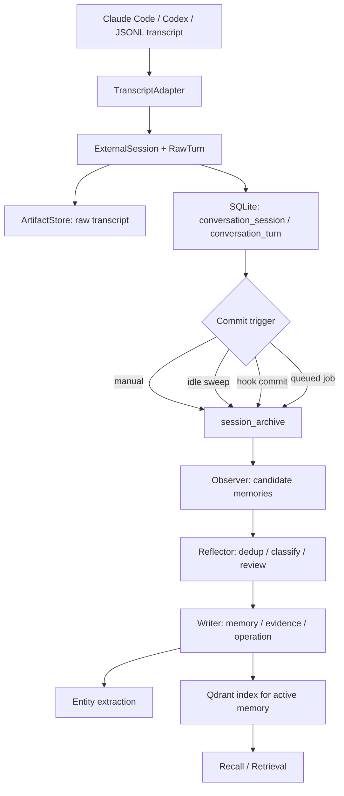

# Dream transcript 归档与长期记忆抽取方案

编写日期：2026-06-12  
适用范围：BHD Memory 的 Dream 入口、Claude Code / Codex / JSONL transcript 扫描、会话归档、长期记忆抽取与治理。  
当前状态：MVP 已实现，本文档描述现状、目标形态和后续补齐路线。

## 0. 结论摘要

Dream 的职责不是简单导入聊天记录，而是把本地开发工具 transcript 转换为可审计、可治理、可检索的长期上下文。推荐采用如下流水线：

```text
transcript scan
  -> adapter normalize
  -> raw artifact + session + turns
  -> manual/idle/hook commit
  -> session archive
  -> Observer extract candidates
  -> Reflector classify/dedup/review
  -> memory + evidence + operation diff
  -> vector index
```

当前实现已经完成主链路：扫描 Claude Code / Codex / 显式 JSONL，保存原始 transcript，写入 `conversation_session` / `conversation_turn`，commit 为 `session_archive`，再通过规则型或 LLM observer 抽取长期记忆，并写入 evidence、operation 和向量索引。

需要优先补齐的能力有三类：

1. **真正增量扫描**：当前有 `sync_cursor` 表，但 adapter 尚未使用 cursor；现阶段依赖唯一键、hash 和 archive hash 做幂等。
2. **Reflector 决策层**：当前主要是规则式去重、敏感信息和 conflict 判断；还没有完整的 `skip/create/update/conflict` 反思器。
3. **更强 transcript parser**：Claude Code / Codex 当前走通用 JSONL 归一化，后续应针对两者的真实事件结构解析 tool call、cwd、session 边界和生命周期事件。

## 1. 目标与非目标

### 1.1 目标

1. 自动发现本机 Claude Code / Codex transcript，并支持显式 JSONL 路径导入。
2. 把不同来源的 transcript 统一归一为 session、turn、artifact。
3. 保留原始 transcript 和标准化 archive，保证长期记忆可追溯。
4. 从会话中抽取未来有用的长期记忆，包括偏好、项目约定、流程、工具经验和用户 profile。
5. 给每条 memory 写入 evidence、operation diff、scope、status、confidence、source。
6. 支持 idle/manual/hook/queued 等多种 commit 入口。
7. 支持 active、pending、conflict、archived、deleted 等治理状态。
8. 把 active memory 写入检索索引，供 recall 和统一检索使用。

### 1.2 非目标

1. 不把完整聊天记录直接当长期记忆注入 prompt。
2. 不让 LLM 无审计地覆盖或删除已有 memory。
3. 不把 Qdrant 当内容真源；SQLite 和 artifact store 才是事实库。
4. 不在首版追求所有工具 transcript 的完美解析；优先保证 Claude Code、Codex、通用 JSONL 的主链路稳定。
5. 不把 hook 当唯一真源；本地 transcript 扫描仍是兜底真源。

## 2. 现有实现概览

### 2.1 核心模块

| 模块 | 职责 |
|---|---|
| `src/bhd_memory/dream/adapters.py` | 定义 transcript adapter、发现 JSONL 文件、归一化 raw turn |
| `src/bhd_memory/dream/service.py` | Dream 主服务：scan、session 持久化、commit、archive、idle sweep |
| `src/bhd_memory/memory.py` | memory 创建、证据、operation、实体、抽取 observer、治理状态 |
| `src/bhd_memory/jobs.py` | 异步执行 `dream_scan`、`dream_commit`、`dream_sweep` |
| `src/bhd_memory/api/app.py` | Dream API 入口 |
| `src/bhd_memory/cli.py` | Dream CLI、watcher、worker 入口 |
| `src/bhd_memory/storage.py` | artifact store：保存 transcript 和 archive |
| `src/bhd_memory/retrieval.py` | 检索 active memory，并记录访问日志 |

### 2.2 默认扫描来源

不传路径时，Dream 会尝试扫描：

```text
~/.claude/projects/**/*.jsonl
~/.codex/sessions/**/*.jsonl
~/.codex/conversations/**/*.jsonl
```

也支持通过环境变量覆盖：

```bash
export BHD_CLAUDE_TRANSCRIPT_DIRS=/path/to/claude/logs
export BHD_CODEX_TRANSCRIPT_DIRS=/path/to/codex/logs
```

显式路径导入使用：

```bash
uv run bhd-memory dream-scan ./example-session.jsonl --auto-commit
```

### 2.3 当前幂等策略

当前实现不是 cursor 增量，而是全量枚举后幂等写入：

| 层级 | 幂等手段 |
|---|---|
| session | `UNIQUE(source_app_id, external_session_id)` |
| turn | `UNIQUE(session_id, external_turn_id)` + `INSERT OR IGNORE` |
| archive | `turns_hash` 相同则不新建 archive |
| memory | `scope + workspace + category + content` 归一化 hash |
| vector | `vector_index_item` 对 target + index 做 upsert 映射 |

这个策略能保证重复扫描不会大量重复写入，但对大目录长期轮询不够高效，因此后续需要引入 cursor。

## 3. 总体架构



Dream 可以拆成四层：

1. **Adapter 层**：负责工具差异，只输出标准 `ExternalSession` 和 `RawTurn`。
2. **Archive 层**：负责原始数据留存、标准化 session/turn、commit archive。
3. **Memory 层**：负责 observer、reflector、writer、governance。
4. **Serving 层**：负责 CLI、API、worker、watcher、hook 集成。

## 4. 数据模型

### 4.1 真源表

| 表 | 说明 |
|---|---|
| `source_app` | transcript 来源，例如 `claude_code`、`codex`、`generic_jsonl` |
| `raw_artifact` | 原始 transcript、session archive 等文件的 artifact 记录 |
| `workspace` | workspace 或 repo 根目录 |
| `conversation_session` | 标准化会话 |
| `conversation_turn` | 标准化 turn |
| `session_archive` | commit 后的会话 archive、摘要和元数据 |

### 4.2 记忆治理表

| 表 | 说明 |
|---|---|
| `memory` | 长期记忆事实，包含 scope、category、status、confidence |
| `memory_evidence` | memory 到 session/turn/artifact 的证据链 |
| `memory_entity` | 从 memory 中抽出的实体、路径、代码符号 |
| `memory_operation` | memory 创建、更新、删除、归档的 operation diff |
| `memory_relation` | 记忆之间的 supersedes 等关系 |
| `memory_access_log` | 检索和 recall 访问日志 |
| `vector_index_item` | SQLite target 到向量索引 id 的映射 |

### 4.3 状态机

```text
conversation_session:
  active -> committed

memory:
  pending -> active
  conflict -> active
  active -> paused
  active -> archived
  active -> deleted
  pending -> deleted
  conflict -> deleted
```

推荐约定：

1. `active`：可被检索和注入上下文。
2. `pending`：需要人工审核，默认不进入向量检索。
3. `conflict`：疑似替换旧记忆，需要人工确认。
4. `paused`：保留但暂不使用。
5. `archived`：历史有效，但被新记忆取代或过期。
6. `deleted`：软删除，保留 operation 记录。

## 5. Adapter 设计

### 5.1 统一接口

```python
class TranscriptAdapter:
    source_name: str
    source_type: str

    def detect(self) -> bool:
        ...

    def list_sessions(self, cursor: dict | None = None) -> list[ExternalSession]:
        ...

    def read_turns(self, session: ExternalSession, cursor: dict | None = None) -> list[RawTurn]:
        ...

    def normalize_turn(self, raw: dict, index: int = 0) -> RawTurn | None:
        ...
```

### 5.2 当前归一化规则

通用 JSONL adapter 会逐行读取 JSON：

1. 从 `role`、`message.role`、`type`、`speaker`、`author` 推断角色。
2. 从 `content`、`message.content`、`text`、`prompt`、`response` 抽取正文。
3. 支持 content 为 string、list、dict。
4. 从 `created_at`、`timestamp`、`time` 推断时间。
5. 从 `id`、`uuid`、`turn_id`、`request_id` 或 line index 推断 turn id。
6. 从 raw 的 `cwd`、`project_path`、`workspace`、`repo_path` 推断项目路径。

### 5.3 后续增强

后续建议给 Claude Code 和 Codex 各自增加专用 parser：

| 能力 | 价值 |
|---|---|
| 解析 session lifecycle | 更准确判断开始、结束、compact、stop |
| 解析 tool call / tool result | 抽取项目流程、命令、失败经验 |
| 解析 cwd / repo / branch | 更准确绑定 workspace |
| 解析 user prompt 与 assistant response | 避免把 tool 输出误当用户事实 |
| 解析 compaction summary | 把 PreCompact 信息作为 archive 摘要输入 |

## 6. Scan 与 Commit 流程

### 6.1 scan

`scan(paths=None, auto_commit=False)` 的推荐行为：

1. 选择 adapter：
   - 有 paths：使用 generic JSONL。
   - 无 paths：使用 Claude Code + Codex。
2. adapter detect：
   - 根目录不存在时返回 detected false。
   - 根目录存在时枚举 JSONL session。
3. 对每个 session：
   - 复制 raw transcript 到 artifact store。
   - 写 `raw_artifact(kind='transcript')`。
   - 读取并标准化 turns。
   - 推断 workspace 和 repo。
   - upsert `conversation_session`。
   - insert ignore `conversation_turn`。
4. 如果 `auto_commit=True`，立刻 commit。

### 6.2 commit

`commit_session(session_id, reason)` 的推荐行为：

1. 读取 session 和 turns。
2. 如果没有 turn，拒绝 commit。
3. 根据 turn id 和 turn hash 计算 `turns_hash`。
4. 如果最新 archive 的 `turns_hash` 一致，直接返回已有 archive。
5. 生成标准 archive JSONL。
6. 写 `raw_artifact(kind='session_archive')`。
7. 写 `session_archive`，包含：
   - `archive_no`
   - `raw_uri`
   - `l0_abstract`
   - `l1_overview`
   - `commit_reason`
   - `turns_hash`
   - `turn_count`
8. 更新 session 状态为 `committed`。
9. 调用 memory extraction。

### 6.3 idle sweep

`sweep_idle(idle_seconds, limit)` 会把超过 idle 阈值的 active session 提交：

```text
WHERE status = 'active'
  AND updated_at <= now - idle_seconds
```

适合和 watcher 配合：

```bash
uv run bhd-memory watch --idle-seconds 1800 --interval 60
```

## 7. 长期记忆抽取方案

### 7.1 Observer

Observer 负责从 archive turns 里生成候选记忆：

```python
CandidateMemory(
    content="我偏好先给结论再展开分析。",
    category="preference",
    scope="global",
    confidence=0.76,
    evidence_turn_ids=["turn_xxx"],
    reasoning="matched explicit memory/preference trigger",
)
```

当前支持两种模式：

| 模式 | 配置 | 行为 |
|---|---|---|
| rule | 默认 | 根据触发词抽取用户显式表达 |
| llm | `BHD_MEMORY_OBSERVER=llm` | 调 OpenAI-compatible LLM 输出 JSON candidates |
| hybrid | `BHD_MEMORY_OBSERVER=hybrid` | LLM candidates 与 rule candidates 合并去重 |

规则型 observer 当前只处理用户 turn，触发词包括：

```text
记住、以后、偏好、喜欢、希望、不要、请先、当前项目、这个项目、使用、采用、
约定、测试、部署、流程、my preference、remember、prefer
```

分类规则：

| 类别 | 判断依据 |
|---|---|
| `preference` | 偏好、喜欢、希望、不要、prefer |
| `procedure` | 命令、测试、部署、流程、约定、使用、采用 |
| `profile` | 我是、我的身份、my role、i am |
| `event` | 默认 fallback |

scope 规则：

| scope | 判断依据 |
|---|---|
| `global` | 用户偏好、身份信息 |
| `workspace` | 当前项目、repo、workspace、流程、项目约定 |
| `session` | 临时会话事实，首版较少自动写入 |
| `agent` | 工具/agent 行为经验，后续增强 |

### 7.2 Reflector

Reflector 的目标是避免自动记忆污染。当前已有简化版策略：

1. `confidence < 0.7` -> `pending`
2. 内容疑似敏感 -> `pending`
3. 内容疑似替换旧记忆，且找到相关 active memory -> `conflict`
4. 其他 -> `active`

推荐补齐完整 Reflector：

```text
candidate + related memories + evidence
  -> action: skip | create | update | conflict
  -> status: active | pending | conflict
  -> reason
  -> supersedes / related relation
```

Reflector 需要检索的上下文：

1. 相同 hash 的 memory。
2. 相同 scope/category/workspace 的 active memory。
3. 相同 entity 的 memory。
4. 向量相似 memory。
5. 最近 rejected/pending 的相似 memory。

### 7.3 Writer

Writer 写入时必须同时完成：

1. `memory`
2. `memory_evidence`
3. `memory_operation`
4. `memory_entity`
5. `vector_index_item`，仅 active memory

所有 memory 必须可从 evidence 追溯回：

```text
memory -> memory_evidence -> conversation_turn -> conversation_session -> raw_artifact
```

## 8. 治理与安全

### 8.1 敏感信息处理

当前敏感关键词包括：

```text
密钥、密码、token、api key、secret、身份证、银行卡、财务、健康、病历、客户隐私
```

命中后默认进入 `pending`，不自动进入检索索引。

推荐增强：

1. 增加 regex 检测 API key、JWT、邮箱、手机号、身份证、银行卡。
2. pending memory 默认不展示全文，只展示脱敏 preview。
3. 对敏感 memory 增加 `metadata.sensitive=true`。
4. 对高危类别支持全局关闭自动抽取。

### 8.2 冲突处理

当前冲突关键词包括：

```text
不再、改为、替换、停止、不要再、no longer、instead of、replace
```

命中后如果存在同 category/scope/workspace 的相关 active memory，就进入 `conflict`。

用户 approve conflict memory 时，推荐行为：

1. 新 memory 变为 active。
2. 被替换 memory 变为 archived。
3. 写 `memory_relation(relation_type='supersedes')`。
4. 写 `memory_operation(op='invalidate')`。
5. 从向量索引删除旧 active memory。

### 8.3 审计要求

所有自动写入都必须有：

1. `actor='dream'`
2. `archive_id`
3. `reasoning`
4. 至少一个 evidence turn
5. operation diff
6. created_at / updated_at

## 9. API、CLI 与后台任务

### 9.1 CLI

```bash
# 扫描显式 JSONL
uv run bhd-memory dream-scan ./example-session.jsonl

# 扫描并立即 commit
uv run bhd-memory dream-scan ./example-session.jsonl --auto-commit

# 手动 commit
uv run bhd-memory dream-commit <session_id>

# commit idle session
uv run bhd-memory dream-sweep --idle-seconds 1800

# 持续 watch
uv run bhd-memory watch --idle-seconds 1800 --interval 60

# 异步扫描
uv run bhd-memory dream-scan ./example-session.jsonl --auto-commit --enqueue
uv run bhd-memory worker
```

### 9.2 API

| Method | Path | 说明 |
|---|---|---|
| `POST` | `/api/dream/scan` | 扫描 transcript |
| `GET` | `/api/dream/sessions` | 列出 session |
| `GET` | `/api/dream/sessions/{session_id}` | 查看 session |
| `POST` | `/api/dream/sessions/{session_id}/commit` | commit session |
| `POST` | `/api/dream/sweep` | 提交 idle session |
| `GET` | `/api/dream/sessions/{session_id}/archive/{archive_no}` | 查看 archive |

### 9.3 Job

| pipeline | 说明 |
|---|---|
| `dream_scan` | 后台扫描 transcript |
| `dream_commit` | 后台 commit 单个 session |
| `dream_sweep` | 后台提交 idle session |

## 10. 增量扫描补齐方案

当前 `sync_cursor` 表已存在，但 adapter 尚未实际使用。建议分两步补齐。

### 10.1 文件级 cursor

记录每个 source app 的：

```json
{
  "files": {
    "/path/to/session.jsonl": {
      "mtime_ns": 123,
      "size": 456,
      "checksum": "optional",
      "last_line": 100
    }
  }
}
```

行为：

1. 文件 size/mtime 未变化则跳过。
2. 文件 append-only 时从 `last_line` 继续读。
3. 文件截断或 rewrite 时重新读取，并依赖 turn 唯一键去重。
4. 定期 compact cursor，移除长期不存在的文件。

### 10.2 Session 级 cursor

对真实工具 transcript，优先记录工具自己的 session id 和最后事件 id：

```json
{
  "sessions": {
    "external_session_id": {
      "last_event_id": "evt_xxx",
      "last_turn_id": "turn_xxx",
      "updated_at": "2026-06-12T..."
    }
  }
}
```

这能更好支持：

1. 多文件组成一个 session。
2. 单文件包含多个 session。
3. tool event 与 user/assistant turn 分离。
4. compaction 后新文件延续旧 session。

## 11. LLM Observer 补齐方案

LLM observer 应该输出严格 JSON：

```json
{
  "candidates": [
    {
      "content": "当前项目测试命令是 uv run pytest。",
      "category": "procedure",
      "scope": "workspace",
      "confidence": 0.82,
      "evidence_turn_ids": ["turn_123"],
      "reasoning": "用户明确说明当前项目测试命令"
    }
  ]
}
```

增强要求：

1. 限制每个 archive 最多 5 到 10 条候选。
2. 禁止把 assistant-only 内容写成用户事实。
3. tool result 可以生成 `procedure` / `lesson` / `agent` memory，但必须标记来源。
4. 对不确定内容降低 confidence，进入 pending。
5. evidence_turn_ids 必须存在，否则丢弃。
6. LLM 超时或失败时 fallback 到 rule observer。

## 12. 验收标准

### 12.1 功能验收

1. 扫描显式 JSONL 后能创建 session 和 turns。
2. `--auto-commit` 后能创建 archive。
3. 记忆类用户表达能生成 memory。
4. memory 有 evidence，可以追溯到 turn。
5. 重复扫描不会产生重复 session、turn、archive、memory。
6. 敏感信息进入 pending，不进入 active 检索。
7. 冲突记忆进入 conflict review。
8. active memory 能被 retrieval 搜到。
9. watcher 能 scan、sweep、run jobs。
10. queued Dream job 能被 worker 执行。

### 12.2 质量验收

1. 规则 observer 单测覆盖偏好、项目流程、敏感信息、冲突信息。
2. adapter 单测覆盖 Claude Code、Codex、generic JSONL 的代表性 raw shape。
3. commit 幂等单测覆盖 archive hash 不变时不重复抽取。
4. cursor 增量单测覆盖 append、rewrite、delete、rename。
5. API 和 CLI 都覆盖 happy path 与错误路径。

## 13. 分阶段路线

### Phase 0：已完成 MVP

1. Claude Code / Codex / generic JSONL 扫描。
2. raw transcript artifact。
3. session / turn 持久化。
4. manual / auto / idle commit。
5. archive JSONL。
6. rule observer。
7. LLM observer 开关。
8. memory / evidence / operation。
9. active memory indexing。
10. review queue。

### Phase 1：稳定性与可解释性

1. 接入 `sync_cursor`，避免大目录反复全量扫描。
2. 为 Codex 和 Claude Code 增加真实 fixture。
3. archive 页面展示 L0/L1、turn、抽取出的 memory。
4. memory evidence 页面展示来源 turn 和 raw artifact。
5. watcher 增加日志和错误隔离。

### Phase 2：Reflector 与去重升级

1. 增加 candidate 相关 memory 检索。
2. 实现 `skip/create/update/conflict` 决策。
3. 引入 entity overlap、vector similarity、hash similarity。
4. conflict approve 后自动 supersede 旧 memory。
5. rejected/pending 历史参与去重。

### Phase 3：更完整的工具适配

1. Claude Code 专用 parser。
2. Codex 专用 parser。
3. hook capture 与 transcript scan 对齐 session id。
4. 支持 PreCompact / Stop / idle lifecycle。
5. 预留 Cursor、Windsurf、OpenCode adapter。

### Phase 4：产品化治理

1. Memory review UI。
2. Archive browser。
3. Memory diff view。
4. Source app 开关。
5. 自动抽取类别开关。
6. 敏感信息脱敏展示。

## 14. 风险与应对

| 风险 | 影响 | 应对 |
|---|---|---|
| transcript 格式变化 | 解析失败或漏记 | adapter fixture + 宽松 fallback + 版本化 parser |
| 自动记忆污染 | 长期上下文质量下降 | evidence、pending、conflict、review、operation diff |
| 重复扫描成本高 | watcher 变慢 | 文件级 cursor + session cursor |
| 敏感信息误入 active | 隐私风险 | 敏感检测、pending 默认、脱敏展示、类别开关 |
| assistant 内容被误写为用户事实 | 记忆不可信 | observer 明确限制，只把 assistant/tool 写入 agent/procedure 类 |
| Qdrant 与 SQLite 不一致 | 检索缺失或脏结果 | `vector_index_item` 映射、rebuild-index、删除同步 |
| hook 生命周期不可靠 | session 无法及时 commit | transcript scan 作为真源，hook 作为增强 |

## 15. 推荐下一步

优先级建议：

1. 写 Claude Code / Codex fixture，锁住 adapter 行为。
2. 实现 `sync_cursor` 文件级增量扫描。
3. 增加 Dream archive + memory evidence 的 UI 展示。
4. 把 Reflector 从当前规则判断升级为独立服务。
5. 增加 Codex / Claude Code 专用 parser，解析 tool call 和 lifecycle。

完成前三项后，Dream 就能从“可用 MVP”进入“长期后台运行也放心”的阶段。
