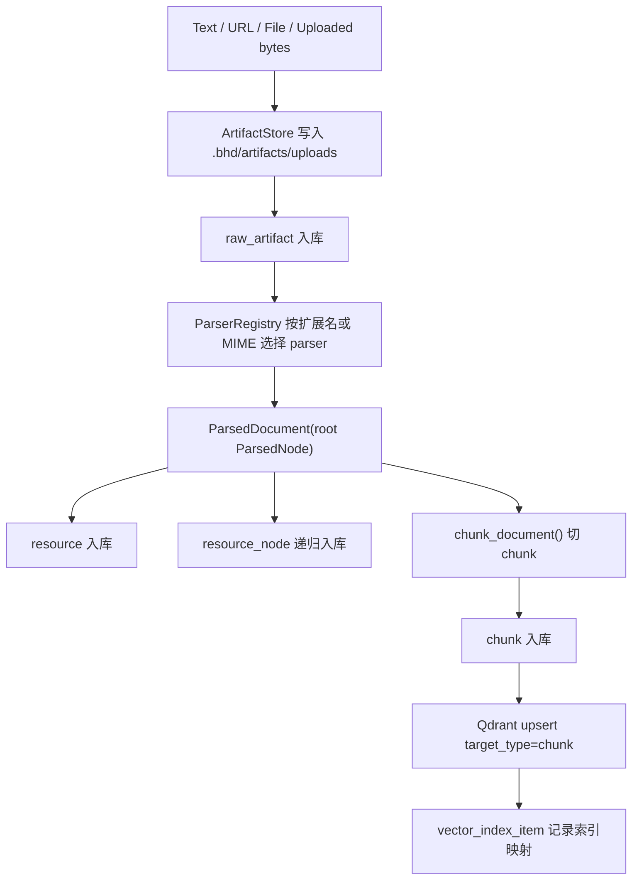

# Knowledge Ingest Implementation

本文说明 BHD Memory 的知识入口是怎样把文本、URL、Markdown、HTML、PDF、DOCX、PPTX、XLSX 等输入解析成 `Resource` / `Node` / `Chunk`，并写入 SQLite 与 Qdrant 的。

代码主线：

- `src/bhd_memory/resources.py`：知识入口编排，负责 artifact、resource、node、chunk、索引写入。
- `src/bhd_memory/parsers/`：各格式 parser，把文件转成 `ParsedDocument` / `ParsedNode` 树。
- `src/bhd_memory/chunking.py`：把 node 文本切成可检索 chunk。
- `src/bhd_memory/database.py`：SQLite truth store schema。
- `src/bhd_memory/indexing/`：Qdrant 向量索引。
- `src/bhd_memory/api/app.py`、`src/bhd_memory/cli.py`、`frontend/src/App.jsx`：API、CLI、Web UI 入口。

## 1. 核心模型

系统把一次知识上传拆成四层：

| 层级 | SQLite 表 | 作用 |
|---|---|---|
| 原始文件 | `raw_artifact` | 保存上传/抓取到的原始字节位置、checksum、mime、metadata。 |
| 资源 | `resource` | 用户可见的知识条目，包含 title、source_uri、workspace、status、artifact_id。 |
| 结构节点 | `resource_node` | 文档内部结构，例如 Markdown section、PDF page、PPT slide、XLSX sheet。 |
| 检索块 | `chunk` | 真正写入 Qdrant 的检索单元，关联 resource 和 node。 |

`Resource` 是知识库里的文档级对象；`Node` 是保留原文结构的层级对象；`Chunk` 是为了检索切出来的最小上下文单元。

此外还有两个辅助表：

- `vector_index_item`：记录 SQLite chunk/memory 与 Qdrant point 的对应关系。
- `resource_acl`：记录 resource 的授权对象和权限。目前 ACL 可以通过 API/CLI 写入和查看，但检索路径还没有基于 ACL 做过滤。

## 2. 入口形态

所有入口最终都会调用 `ResourceService`。

### API

FastAPI 在 `src/bhd_memory/api/app.py` 暴露这些知识入口：

| Endpoint | 输入 | 实现 |
|---|---|---|
| `POST /api/resources/upload` | multipart file | 同步调用 `ingest_bytes()`；异步时先 `create_upload_artifact()`，再入队 `resource_ingest_artifact`。 |
| `POST /api/resources/text` | JSON `{title, text, ...}` | 同步调用 `ingest_text()`；异步入队 `resource_text`。 |
| `POST /api/resources/link` | JSON `{url, title, ...}` | 同步调用 `ingest_url()`；异步入队 `resource_url`。 |
| `GET /api/resources` | query | 列出 resource。 |
| `GET /api/resources/{id}` | query `include_chunks` | 查看 resource、node、chunk。 |
| `POST /api/resources/{id}/reindex` | query `enqueue` | 重新把已有 chunk 写入 Qdrant。 |

### CLI

`src/bhd_memory/cli.py` 提供对应命令：

```bash
uv run bhd-memory upload-file ./doc.pdf --workspace-name bhd
uv run bhd-memory upload-text "Architecture Note" "text body"
uv run bhd-memory upload-url https://example.com/note.html --title "Note"
```

加 `--enqueue` 后不会立即解析，而是写入 `ingest_job`，由 `uv run bhd-memory worker` 或 API 的 jobs runner 执行。

### Web UI

前端 `frontend/src/App.jsx` 的 Knowledge 面板调用：

- `uploadText()` -> `/api/resources/text`
- `uploadFile()` -> `/api/resources/upload`
- `uploadUrl()` -> `/api/resources/link`

当前 UI 走同步上传，没有暴露 `enqueue` 开关。

## 3. 同步 ingest 流程

同步上传的完整流程如下：



入口方法分别做了少量预处理：

- `ingest_text(text, title=...)`：清理文本，转成 UTF-8 bytes，文件名为 `<title>.txt`，mime 为 `text/plain`。
- `ingest_file(path, ...)`：把本地文件 copy 到 artifact store，metadata 记录 `filename` 和 `original_path`。
- `ingest_bytes(data, filename, ...)`：把上传字节写入 artifact store。
- `ingest_url(url, ...)`：用 `urllib.request` 抓取 URL，设置 user-agent `bhd-memory/0.1`，最多读取 25MB；metadata 记录 `source_url`，resource 的 `source_uri` 使用原始 URL。
- `ingest_artifact(artifact_id, ...)`：异步 worker 或已经存在 artifact 的场景，从 `raw_artifact` 恢复文件并继续解析。

真正写 Resource / Node / Chunk 的逻辑集中在 `_ingest_existing_artifact()`：

1. 如果没有 `workspace_id`，用 `workspace_name` 或 `Default` 调 `ensure_workspace()`。
2. 通过 `self.registry.parse(stored.path, title=..., mime=...)` 解析文件。
3. 插入 `resource`，状态固定为 `ready`。
4. `_persist_nodes()` 递归插入 `resource_node`。
5. `chunk_document(parsed)` 生成 `ChunkDraft`。
6. `_persist_chunk()` 插入 `chunk`。
7. `_index_chunk()` 把 `compiled_text` 写入 Qdrant，并记录 `vector_index_item`。
8. 最后 `conn.commit()`。

## 4. ParserRegistry 与格式解析

parser 的统一接口定义在 `src/bhd_memory/parsers/base.py`：

```python
class Parser(Protocol):
    extensions: set[str]
    mime_types: set[str]

    def parse(self, path, *, title=None, mime=None) -> ParsedDocument:
        ...
```

`ParserRegistry.get()` 先看文件扩展名，再看 MIME；没有命中时回退到 `PlainTextParser`。

`default_registry()` 当前注册顺序：

1. `MarkdownParser`
2. `HtmlParser`
3. `PdfParser`
4. `DocxParser`
5. `PptxParser`
6. `XlsxParser`
7. `PlainTextParser`

各格式的实际行为：

| 格式 | Parser | Node 结构 | 说明 |
|---|---|---|---|
| `.txt`, `.log`, `.json`, `.jsonl`, `.csv`, `.tsv` | `PlainTextParser` | root document | UTF-8 decode，失败字符替换，全文作为一个 document node。 |
| `.md`, `.mdx`, `.markdown` | `MarkdownParser` | root + section children | 按 `#` 到 `######` heading 切成扁平 section，metadata 写 `heading_level`。 |
| `.html`, `.htm` | `HtmlParser` | root document | 用 Python `HTMLParser` 抽可见文本，跳过 `script/style/noscript`。 |
| `.pdf` | `PdfParser` | root + page children | 用 `pypdf.PdfReader` 逐页 `extract_text()`，metadata 写 `page`。 |
| `.docx` | `DocxParser` | root document | 直接解压 OOXML，读取 `word/document.xml` 中段落文本。 |
| `.pptx` | `PptxParser` | root + slide children | 读取 `ppt/slides/slide*.xml` 中的文本，metadata 写 `slide`。 |
| `.xlsx` | `XlsxParser` | root + sheet children | 读取 shared strings 和 worksheet cell value，行内用竖线分隔，metadata 写 `sheet`。 |

parser 输出的统一结构是：

```python
ParsedDocument(
    title="...",
    mime="...",
    root=ParsedNode(
        title="...",
        text="...",
        node_type="document",
        path="...",
        metadata={},
        children=[...],
    ),
)
```

## 5. Node 入库

`_persist_nodes()` 会把 `ParsedDocument.root` 和所有 children 递归写入 `resource_node`。

每个 node 会保存：

- `node_type`：`document`、`section`、`page`、`slide`、`sheet` 等。
- `title`：节点标题。
- `path`：用于定位来源，例如 `Doc.pdf/Page 1`。
- `parent_id`：父节点，保留文档结构。
- `order_no`：同级顺序。
- `metadata_json`：parser 提供的结构化信息。
- `l0_abstract`：节点文本清理后的前 300 字符。
- `l1_overview`：节点文本清理后的前 2400 字符。

当前 `l0_abstract` / `l1_overview` 是截断式摘要，不调用 LLM。

## 6. Chunk 切分

切分逻辑在 `src/bhd_memory/chunking.py`。

`chunk_document()` 默认参数：

- `max_tokens = 900`
- `overlap_tokens = 90`

流程：

1. 如果 root 有 children，则逐个 child 切分；否则切 root。
2. 对每个 node 先 `clean_text()`。
3. 用 `rough_token_count()` 估算 token 数。这里的 token 是项目自定义的正则 token：英文/数字路径类 token 加单个中文字符。
4. 如果 node 不超过 900 token，直接生成一个 chunk。
5. 如果超过 900 token，用 `word_tokens()` 生成 token 序列，按 `900` 窗口、`90` overlap 滑窗切成多个 part。

每个 `ChunkDraft` 包含：

- `text`：原始 chunk 正文。
- `compiled_text`：写入 Qdrant 和检索返回的文本，格式为：

```text
Document: <document title>
Path: <node path>

<chunk text>
```

- `title` / `path` / `node_type`
- `page`、`line_start`、`line_end`
- `token_count`
- `metadata`

长文本 part 的 path 会追加 `#part-N`，入库时再映射回原 node。

## 7. Chunk 入库与索引

`_persist_chunk()` 写入 `chunk` 表：

- `resource_id`、`node_id`
- `text`
- `compiled_text`
- `page`
- `line_start`、`line_end`
- `token_count`
- `hash`：`compiled_text` 的 SHA-256。
- `metadata_json`：包含 parser metadata，并补充 `path`、`title`。

`_index_chunk()` 只索引 `status == "ready"` 的 resource。写入 Qdrant 的 target 是：

```python
target_type = "chunk"
target_id = chunk["id"]
content = chunk["compiled_text"]
```

Qdrant payload 包含：

- `workspace_id`
- `resource_id`
- `resource_title`
- `resource_status`
- `mime`
- `path`
- `page`
- `status = "active"`

`vector_index_item` 同时记录：

- `target_type = chunk`
- `target_id = <chunk_id>`
- `vector_id = <qdrant point id>`
- `index_name`
- `embedding_model`

## 8. Qdrant 索引实现

Qdrant 后端在 `src/bhd_memory/indexing/qdrant.py`。

collection 同时建两种向量：

- `dense`：固定维度，默认 `BHD_EMBEDDING_DIM=384`。
- `sparse`：Qdrant sparse vector。

当前 embedding 是本地 deterministic hash embedding，不依赖外部模型：

- `dense_hash_embedding(text, dim)`：把 token hash 到固定维度，归一化。
- `sparse_token_embedding(text)`：把 token hash 到 sparse index，按词频平方根归一化。

搜索时：

1. 对 query 同时生成 dense 和 sparse。
2. 优先使用 Qdrant Query API 的 prefetch + RRF fusion。
3. 如果当前 Qdrant 不支持 fusion，则应用层做 dense/sparse 两次查询，再用一个小型 RRF 合并排名。

Qdrant point id 是稳定的：

```python
uuid5(NAMESPACE_URL, f"bhd:{target_type}:{target_id}")
```

因此同一个 chunk 重新索引会覆盖同一个 point。

## 9. 异步任务链路

当 API 或 CLI 指定 `enqueue` 时，会创建 `ingest_job`：

| pipeline | worker 行为 |
|---|---|
| `resource_ingest_artifact` | 调 `ResourceService.ingest_artifact()`。 |
| `resource_text` | 调 `ResourceService.ingest_text()`。 |
| `resource_url` | 调 `ResourceService.ingest_url()`。 |
| `resource_reindex` | 调 `ResourceService.reindex_resource()`。 |

文件上传的异步路径会先把请求体写成 `raw_artifact`，因为 worker 运行时已经拿不到 HTTP upload stream。文本和 URL 则直接把必要字段放进 job payload。

worker 主逻辑在 `src/bhd_memory/jobs.py`：

1. `run_next()` 找一个 `queued` job，标记为 `running`。
2. `_run_job()` 按 `pipeline` 分派到资源、记忆、Dream、维护或图谱服务。
3. 成功后写 `status=succeeded`、`stage=done`、`result_json`。
4. 异常后写 `status=failed`、`stage=failed`、`error`。

## 10. 检索与查看

知识检索有两条路径：

### 统一检索

`RetrievalService.retrieve()` 中，`target_types=["resource"]` 会被标准化成 `["chunk"]`。

流程：

1. 调 Qdrant search，过滤 `payload.status = active`。
2. 对命中的 `chunk_id` 回 SQLite join `chunk`、`resource`、`resource_node`。
3. 只返回 `resource.status == ready` 的 chunk。
4. 如果传了 `workspace_id`，resource 必须属于该 workspace。
5. 返回 `compiled_text`、source 信息、evidence 和 `load_more_uri`。

返回的 source 形态类似：

```json
{
  "kind": "resource",
  "resource_id": "...",
  "title": "...",
  "uri": "...",
  "path": "...",
  "page": 1
}
```

### Knowledge tools

`KnowledgeService` 提供：

- `list()`：列 resource。
- `view(resource_id, chunk_id=None)`：查看 resource 或单个 chunk。
- `grep(pattern, ...)`：直接在 SQLite chunk text 上做正则搜索。
- `query(query, ...)`：复用 `RetrievalService` 做向量检索。

对应 API 是 `/api/knowledge/list`、`/api/knowledge/view/{resource_id}`、`/api/knowledge/grep`、`/api/knowledge/query`。

## 11. 删除与重建

`delete_resource(resource_id)` 是软删除：

1. 把 `resource.status` 更新为 `deleted`。
2. 删除该 resource 所有 chunk 的 Qdrant point。
3. 删除对应 `vector_index_item`。
4. 不物理删除 `resource_node` 和 `chunk` 行。

`reindex_resource(resource_id)` 会读取现有 chunk，重新执行 `_index_chunk()`。适合 Qdrant collection 丢失、embedding 配置变化或索引损坏后的单资源修复。

全量重建由 `MaintenanceService.rebuild_index()` 负责，job pipeline 是 `index_rebuild`。

## 12. 当前边界与改进点

当前实现偏轻量，适合 MVP 和本地个人知识库。需要注意：

- URL 抓取只读响应 body，不做网页正文智能抽取、链接展开或站点 crawling。
- URL 最多读取 25MB，超过部分会被截断。
- PDF 只用 `pypdf.extract_text()`，扫描版 PDF 没有 OCR fallback。
- DOCX/PPTX/XLSX parser 直接读 OOXML XML，能抽文本，但不保留复杂版式、图片、批注、公式语义。
- Markdown section 是扁平切分，没有构建 heading 父子层级。
- chunk token 是正则估算，不是模型 tokenizer。
- checksum 会保存并建索引，但当前 ingest 不基于 checksum 自动去重；同一文件可生成多个 resource。
- Qdrant 是检索索引，不是 truth store；权威内容仍以 SQLite 的 `resource`、`resource_node`、`chunk` 为准。
- Resource ACL 当前可记录，但统一检索尚未强制应用 ACL。

## 13. 如何新增一种文档格式

新增 parser 的最小步骤：

1. 在 `src/bhd_memory/parsers/` 新增 parser 类，实现 `extensions`、`mime_types`、`parse()`。
2. `parse()` 返回 `ParsedDocument`，尽量保留结构到 children，例如 page、section、sheet、chapter。
3. 把页码、行号、标题层级等定位信息写入 `ParsedNode.metadata`。
4. 在 `default_registry()` 注册 parser。
5. 为 parser 加测试：至少验证能生成 resource、node、chunk，并能被 `RetrievalService` 查回。

如果 parser 能提供稳定来源定位，优先写到：

- `ParsedNode.path`
- `metadata["page"]`
- `metadata["line_start"]` / `metadata["line_end"]`
- `metadata["heading_level"]`

这样后续 chunk evidence 和 `load_more_uri` 会更容易回到原文。
