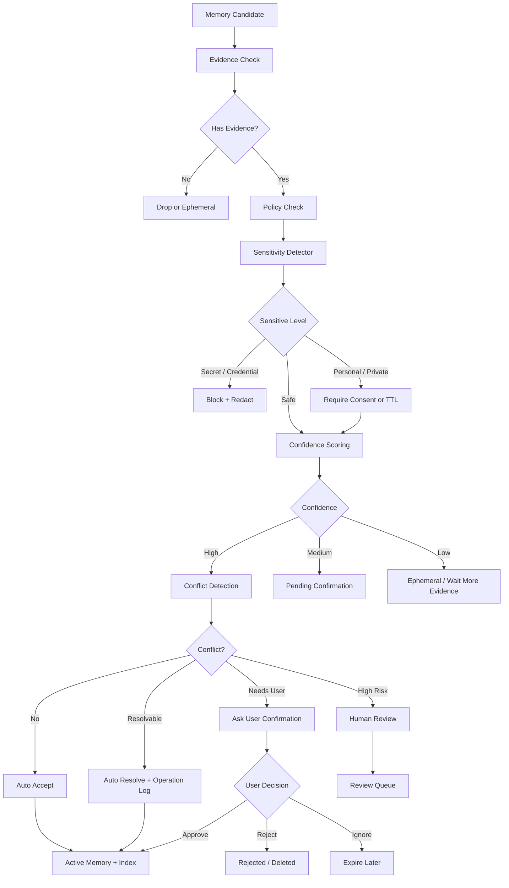
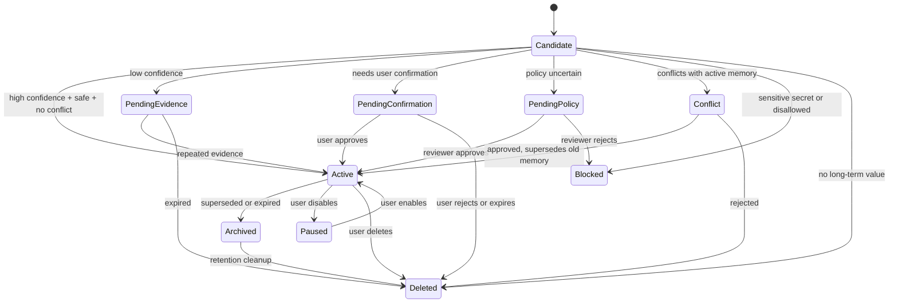

# 记忆审核与治理方案

编写日期：2026-06-12  
适用范围：BHD Memory 的长期记忆写入、Dream 抽取、低置信度候选、敏感信息、冲突记忆、人工审核队列与用户确认机制。  
核心结论：`review_queue` 不应成为所有不确定记忆的默认出口，而应作为自动策略、用户确认、脱敏与暂存都无法安全处理时的最后升级通道。

## 0. 结论摘要

长期记忆系统的风险不在于“漏记一条”，而在于“错误、敏感或过时的信息被长期使用”。因此，记忆写入不应是：

```text
candidate memory -> low confidence / sensitive / conflict -> human review
```

更推荐的治理模型是：

```text
candidate memory
  -> evidence check
  -> policy check
  -> sensitivity detection
  -> confidence scoring
  -> conflict detection
  -> automatic action
      -> auto-accept
      -> ask-user-confirmation
      -> store-as-ephemeral
      -> redact-and-store
      -> block
      -> human-review
```

对应三类典型问题：

| 类型 | 推荐处理 | 是否默认进人工审核 |
|---|---|---|
| 低置信度 | 不写长期记忆，进入待确认池或短期暂存，等待更多证据 | 否 |
| 敏感信息 | 默认阻断；必要时脱敏、加密、TTL、显式授权 | 否 |
| 冲突记忆 | 版本化候选，保留旧记忆，优先用户确认或规则自动解决 | 否 |
| 高风险且无法自动决策 | 进入人工审核 | 是 |

人工审核的定位应改为：

> 仅当系统无法通过自动策略、用户确认、脱敏、暂存或阻断做出安全决策时，才进入人工审核。

这样可以同时降低人工成本、减少敏感信息暴露、避免审核队列变成垃圾桶，并让长期记忆更可解释。

## 1. 背景与问题

当前系统已有 `memory.status`、`confidence`、`memory_evidence`、`memory_operation`、`memory_relation`、`review_queue()` 和 `approve_memory()` 等基础能力。现有实现中，低置信度或敏感候选会进入 `pending`，疑似冲突会进入 `conflict`，`review_queue` 返回这两类状态。LLM observer 已经具备 evidence role guard：用户事实类 memory 必须至少有一个 user/human turn 作为证据，assistant/tool-only evidence 只允许生成 procedure、lesson 或 agent scope 经验。

这个方向是正确的，但如果产品语义上把“低置信度、敏感信息、冲突记忆”都直接交给人工审核，会出现几个问题：

1. **审核成本不可控**：低置信度候选往往最多，全部进入人工审核会迅速淹没真正需要判断的风险项。
2. **敏感信息二次暴露**：把密钥、证件号、地址、健康信息放进人工队列，本身就扩大了暴露面。
3. **冲突判断缺少上下文**：审核员很难只凭两条 memory 判断谁更新，必须依赖证据、时间、scope、来源和用户意图。
4. **长期记忆污染**：如果审核流程只做“批准/拒绝”，而不记录原因、替代关系和有效期，后续仍会产生过期或互相矛盾的记忆。
5. **用户控制感不足**：很多偏好和个人信息不应由后台人员判断，而应由用户确认。

因此，本方案的目标不是取消人工审核，而是把它放在更精确的位置。

## 2. 设计原则

### 2.1 最小长期化

不是所有有用信息都应该写入长期记忆。系统应区分：

| 层级 | 用途 | 生命周期 |
|---|---|---|
| 当前上下文 | 当前对话或任务使用 | 当前会话 |
| 短期暂存 | 可能有用但证据不足 | 小时到数天 |
| 待确认候选 | 需要用户或更多证据确认 | 到确认或过期 |
| 长期记忆 | 高价值、可复用、可追溯 | 长期，支持更新和删除 |

低置信度信息优先停留在短期暂存或待确认候选，不应急着长期化。

### 2.2 敏感默认拒绝

敏感信息的默认策略应是“不存”，而不是“交给人工看”。只有满足以下条件时才允许长期保存：

1. 产品功能确实需要。
2. 用户明确授权。
3. 有明确 scope、TTL 和删除入口。
4. 已进行脱敏、加密或访问控制。
5. 有审计记录。

### 2.3 冲突版本化

冲突不是错误，而是长期记忆系统的正常现象。用户偏好、项目路径、工具选择、身份信息、工作状态都会随时间变化。

系统不应直接覆盖旧记忆，而应：

1. 保留旧记忆。
2. 新建候选记忆。
3. 记录冲突关系。
4. 根据时间、证据、scope、来源和用户确认决定是否替换。
5. 被替换的旧记忆进入 `archived`，并写入 `invalid_at`。

### 2.4 证据优先

每条长期记忆都必须能回答：

1. 这条记忆来自哪次会话、哪个 turn、哪个 artifact？
2. 原始证据是什么？
3. 是谁创建、批准、更新或删除的？
4. 为什么做出这个决策？
5. 什么时候开始有效，什么时候失效？

### 2.5 人工审核最小化

人工审核只处理自动系统无法安全决策的情况，例如：

1. 涉及权限、付款、医疗、法律、安全策略等高风险领域。
2. 候选记忆价值很高，但存在无法自动解决的敏感性或冲突。
3. 用户主动申诉或要求恢复。
4. 自动策略异常，例如规则互相矛盾或模型输出格式不可信。

## 3. 总体架构



关键变化：

1. `pending` 不等于人工审核，它可以是“待自动确认”或“待用户确认”。
2. 敏感信息优先 `block`、`redact`、`consent_required`，不是优先进人工队列。
3. `conflict` 应绑定旧记忆和证据，形成可解释的替换链。
4. `review_queue` 只展示真正需要人工处理的高风险项目。

## 4. 记忆候选分级

### 4.1 置信度分层

建议把 `confidence` 从单一分数扩展为可解释的评分来源。

| 维度 | 说明 | 示例 |
|---|---|---|
| evidence_score | 是否有明确原文证据 | 用户明确说“我偏好 Python” |
| repetition_score | 是否多次出现 | 多次提到同一偏好 |
| source_score | 来源可信度 | 用户本人 > assistant 推断 > 工具日志 |
| recency_score | 最近是否仍然有效 | 最近一周的偏好高于一年前 |
| specificity_score | 是否具体可执行 | “喜欢简洁回答”高于“可能比较忙” |
| risk_penalty | 风险扣分 | 涉及隐私、权限、安全则扣分 |

推荐阈值：

| 分数区间 | 默认动作 |
|---|---|
| `>= 0.85` | 若无敏感和冲突，自动写入 `active` |
| `0.70 - 0.85` | 写入 `pending_confirmation` 或等待二次证据 |
| `0.45 - 0.70` | 仅短期暂存，不进入长期记忆 |
| `< 0.45` | 丢弃，只保留在原始 archive 中 |

当前实现中 `confidence < 0.7` 进入 `pending`，后续可以把这个 `pending` 进一步细分为 `pending_confirmation`、`pending_evidence`、`pending_policy`。

### 4.2 信息价值分层

不是所有高置信信息都有长期价值。

| 价值等级 | 描述 | 默认动作 |
|---|---|---|
| 高 | 长期偏好、项目约定、稳定身份、工作流、工具选择 | 可长期保存 |
| 中 | 当前项目阶段、短期目标、近期任务习惯 | 设置 TTL 或 workspace scope |
| 低 | 闲聊、一次性命令、临时调试细节 | 不长期保存 |

例子：

| 候选 | 判断 | 动作 |
|---|---|---|
| 用户偏好中文回复 | 高价值，低风险 | 自动写入或确认后写入 |
| 用户今天下午要调试某 bug | 中价值，短时效 | 短期暂存，设置 TTL |
| 用户可能喜欢 Rust | 低置信 | 等更多证据 |
| 用户输入了 API key | 高敏感 | 阻断并脱敏，不长期保存 |

## 5. 敏感信息处理

### 5.1 敏感级别

建议把敏感检测结果分为四级。

| 级别 | 类型 | 默认动作 |
|---|---|---|
| S0 | 非敏感 | 正常进入后续流程 |
| S1 | 轻度个人信息 | 可保存，但应有 scope 和删除入口 |
| S2 | 私密信息 | 需要用户授权、TTL、脱敏或加密 |
| S3 | 密钥/证件/金融/高危信息 | 默认阻断，不进入人工队列 |

### 5.2 典型敏感类型

| 类型 | 示例 | 推荐策略 |
|---|---|---|
| 凭证密钥 | API key、token、password、private key | 阻断，保存脱敏事件，不保存原文 |
| 身份证件 | 身份证号、护照、社保号 | 默认不存，需要显式授权 |
| 金融信息 | 银行卡、支付账号 | 默认不存 |
| 健康信息 | 病历、诊断、药物 | 默认不存或强授权 |
| 家庭住址 | 精确地址、门牌号 | 默认不存或用户授权 |
| 联系方式 | 手机、邮箱 | 按用途授权，最小化保存 |
| 工作机密 | 内部密钥、未公开项目、客户数据 | workspace policy 决定，默认 pending_policy |

### 5.3 脱敏策略

敏感候选不应直接进入 review queue。推荐动作：

```text
raw candidate: "用户的 OpenAI API key 是 sk-..."
stored event:  "用户曾输入 OpenAI API key，系统已阻断长期保存"
metadata:      {"sensitive_type": "api_key", "redacted": true}
status:        "blocked"
```

可保存的信息是“发生过敏感输入”这个治理事件，而不是敏感值本身。

### 5.4 用户授权

对于确实有必要保存的私密信息，系统应向用户确认：

```text
我检测到这条信息可能属于私密信息。是否允许我把它作为长期记忆保存？

可选项：
1. 不保存
2. 仅本项目保存，30 天后过期
3. 保存脱敏版本
```

授权记录应写入 `memory_operation`，包括 actor、reasoning、created_at 和策略版本。

## 6. 低置信度处理

### 6.1 不直接人工审核

低置信度候选的主要问题不是风险，而是不确定。更合适的动作是：

1. 丢弃候选，但保留原始 archive。
2. 写入短期暂存，后续对话中用于弱信号。
3. 等待重复证据，达到阈值后再长期化。
4. 在自然时机向用户确认。

### 6.2 待确认池

建议新增候选层，而不是把所有候选都写进 `memory` 表：

| 字段 | 说明 |
|---|---|
| id | candidate id |
| content | 候选内容 |
| category | 类别 |
| scope | 建议 scope |
| confidence | 当前置信度 |
| evidence_json | 证据列表 |
| decision | suggested action |
| status | open / confirmed / rejected / expired |
| expires_at | 过期时间 |
| created_at | 创建时间 |

如果暂不新增表，也可以短期使用 `memory.status = 'pending'`，并在 `metadata_json` 中写入：

```json
{
  "pending_reason": "low_confidence",
  "recommended_action": "wait_more_evidence",
  "expires_at": "2026-06-19T00:00:00Z"
}
```

### 6.3 自动提升

当后续会话出现相同或相近证据时，系统可以自动提升：

```text
candidate A: "用户可能偏好 TypeScript", confidence 0.58
new evidence: "用户明确说以后这个项目优先用 TypeScript"
merged candidate: confidence 0.86
action: active
```

提升时需要记录：

1. 原候选 id。
2. 新证据来源。
3. 分数变化。
4. 决策原因。

## 7. 冲突记忆处理

### 7.1 冲突类型

| 类型 | 示例 | 推荐动作 |
|---|---|---|
| 偏好变化 | 之前偏好 Python，现在偏好 TypeScript | 用户确认或最近明确陈述覆盖 |
| 项目约定变化 | 之前用 SQLite，现在迁移 Postgres | workspace scope 内版本化 |
| 身份信息变化 | 用户职位、团队、地点变化 | 用户确认 |
| 时间状态变化 | 当前任务、短期目标变化 | TTL 或自动过期 |
| 互斥事实 | 两条事实不能同时为真 | conflict + 证据比较 |

### 7.2 冲突关系

建议使用 `memory_relation` 记录候选和旧记忆关系：

| relation_type | 含义 |
|---|---|
| `conflicts_with` | 内容互斥，但尚未解决 |
| `supersedes` | 新记忆替代旧记忆 |
| `refines` | 新记忆是旧记忆的更具体版本 |
| `duplicates` | 重复记忆 |

### 7.3 冲突解决策略

优先级建议：

1. 用户明确确认的新信息优先。
2. 同一 workspace 内的项目约定优先于 global。
3. 最近且高置信证据优先于旧证据。
4. 明确事实优先于模型推断。
5. 敏感或高风险信息不自动覆盖。

### 7.4 用户确认文案

当冲突影响长期偏好时，优先问用户，而不是交给人工审核：

```text
我之前记得你偏好 Python，但你刚才提到这个项目优先使用 TypeScript。
要把这个项目的语言偏好更新为 TypeScript 吗？
```

用户选择后：

| 用户选择 | 系统动作 |
|---|---|
| 更新 | 新记忆 `active`，旧记忆 `archived`，关系 `supersedes` |
| 保留旧记忆 | 新候选 `rejected` 或 `deleted` |
| 仅本项目 | 新记忆使用 workspace scope，不影响 global |
| 稍后再说 | 保持 `pending_confirmation`，设置过期时间 |

## 8. 状态机设计

### 8.1 推荐状态

当前已有状态：

```text
active
pending
conflict
paused
archived
deleted
```

建议演进为更细的状态或通过 `metadata_json.pending_reason` 表达细分原因：

| 状态 | 含义 | 是否检索 | 是否进入人工审核 |
|---|---|---:|---:|
| `active` | 已生效长期记忆 | 是 | 否 |
| `pending_confirmation` | 等用户确认 | 否 | 否 |
| `pending_evidence` | 等更多证据 | 否 | 否 |
| `pending_policy` | 等策略或管理员确认 | 否 | 视情况 |
| `conflict` | 与已有记忆冲突 | 否 | 视风险 |
| `blocked` | 被策略阻断 | 否 | 否 |
| `redacted` | 已脱敏保存 | 视内容 | 否 |
| `paused` | 用户暂停使用 | 否 | 否 |
| `archived` | 已过期或被替代 | 否 | 否 |
| `deleted` | 软删除 | 否 | 否 |

如果短期不改 schema，可以继续使用 `pending`，并在 metadata 中写入：

```json
{
  "pending_reason": "low_confidence | sensitive | user_confirmation | policy | ttl",
  "recommended_action": "wait_more_evidence | ask_user | redact | block | human_review",
  "risk_level": "low | medium | high",
  "expires_at": "2026-06-19T00:00:00Z"
}
```

### 8.2 状态流转



## 9. 决策矩阵

### 9.1 默认动作矩阵

| 条件 | 默认动作 | 状态 | 进入索引 |
|---|---|---|---:|
| 高置信、低风险、无冲突 | 自动接受 | `active` | 是 |
| 中置信、低风险 | 等用户或更多证据 | `pending` | 否 |
| 低置信 | 短期暂存或丢弃 | 不写 memory 或 `pending` | 否 |
| S3 敏感 | 阻断并脱敏记录 | `blocked` | 否 |
| S2 敏感且用户未授权 | 请求授权 | `pending` | 否 |
| S2 敏感且用户授权 | 脱敏/加密/TTL 保存 | `active` 或 `redacted` | 视情况 |
| 与旧记忆冲突，可自动解决 | 替换旧记忆 | `active` + 旧 `archived` | 是 |
| 与旧记忆冲突，需要用户判断 | 请求用户确认 | `conflict` 或 `pending` | 否 |
| 高风险且策略不确定 | 人工审核 | `pending` | 否 |

### 9.2 分类示例

| 输入 | 系统判断 | 推荐动作 |
|---|---|---|
| “以后这个项目默认用中文注释。” | 明确项目偏好 | workspace active |
| “我可能之后会换成 Go。” | 低置信未来意图 | pending_evidence 或不存 |
| “我的 token 是 sk-...” | 凭证 | block + redact |
| “我住在上海。” | 个人信息，低风险 | 可保存 global/profile，允许删除 |
| “我家的详细地址是...” | 私密地址 | 请求授权或不存 |
| “之前用 SQLite，现在改 PostgreSQL。” | 项目约定冲突 | workspace conflict，确认后 supersedes |
| “不要再记我这类偏好。” | 用户隐私偏好 | 写入 memory policy，后续阻断同类写入 |

## 10. 数据模型建议

### 10.1 保持现有表的最小改造

短期可以不改 schema，只强化 `metadata_json` 和 `memory_operation`：

```json
{
  "governance": {
    "decision": "pending_confirmation",
    "pending_reason": "low_confidence",
    "risk_level": "low",
    "sensitivity": {
      "level": "S0",
      "types": []
    },
    "conflict": {
      "has_conflict": false,
      "related_memory_ids": []
    },
    "policy_version": "memory-governance-v1",
    "expires_at": "2026-06-19T00:00:00Z"
  }
}
```

优点：

1. 不影响当前测试和 API。
2. 可以快速让 review queue 具备更精细原因。
3. 后续可平滑迁移到独立表。

### 10.2 中期新增候选表

建议新增 `memory_candidate`，把“候选”和“长期记忆”分离：

| 字段 | 类型 | 说明 |
|---|---|---|
| id | TEXT | candidate id |
| content | TEXT | 候选内容 |
| scope | TEXT | 建议 scope |
| workspace_id | TEXT | workspace |
| category | TEXT | 类别 |
| confidence | REAL | 综合置信度 |
| status | TEXT | open / confirmed / rejected / expired |
| decision | TEXT | auto_accept / ask_user / wait_evidence / human_review / block |
| risk_level | TEXT | low / medium / high |
| sensitivity_json | TEXT | 敏感检测结果 |
| conflict_json | TEXT | 冲突检测结果 |
| evidence_json | TEXT | 证据 |
| expires_at | TEXT | 过期时间 |
| created_at | TEXT | 创建时间 |
| updated_at | TEXT | 更新时间 |

只有 `confirmed` 或 `auto_accept` 的候选才写入 `memory`。

### 10.3 审核任务表

如果人工审核变成独立产品能力，建议新增 `review_task`：

| 字段 | 说明 |
|---|---|
| id | 审核任务 |
| target_type | memory / candidate / resource / policy |
| target_id | 目标 id |
| reason | human_review 原因 |
| risk_level | 风险等级 |
| priority | 优先级 |
| status | open / approved / rejected / escalated / expired |
| assignee | 审核人 |
| decision_json | 审核结果 |
| created_at | 创建时间 |
| resolved_at | 解决时间 |

这样 `review_queue` 返回的是审核任务，而不是简单返回 `pending/conflict` memory。

## 11. API 与产品交互

### 11.1 API 建议

保留当前 API：

```text
GET  /memories/review
POST /memories/{id}/approve
```

建议新增：

```text
GET  /memory-candidates
POST /memory-candidates/{id}/confirm
POST /memory-candidates/{id}/reject
POST /memory-candidates/{id}/snooze

GET  /review-tasks
POST /review-tasks/{id}/approve
POST /review-tasks/{id}/reject
POST /review-tasks/{id}/assign

POST /memories/{id}/archive
POST /memories/{id}/pause
POST /memories/{id}/resume
POST /memories/{id}/delete
```

### 11.2 Review Queue UI

审核队列不应只显示 content。每个 item 至少展示：

1. 候选内容。
2. 风险等级。
3. 待审核原因。
4. 推荐动作。
5. 证据片段和来源。
6. 相关旧记忆。
7. 可能影响的 scope。
8. 操作按钮：批准、拒绝、脱敏保存、仅本项目保存、归档旧记忆、请求用户确认。

### 11.3 用户确认 UI

用户确认应嵌入自然工作流，不要让用户进入后台审核台。典型交互：

```text
我注意到一个可能要更新的偏好：

旧记忆：你通常偏好 Python。
新证据：你说这个项目以后优先用 TypeScript。

要怎么处理？
```

选项：

| 选项 | 系统动作 |
|---|---|
| 更新为 TypeScript | 新 memory active，旧 memory archived |
| 仅这个项目使用 TypeScript | 新 memory workspace active，global 不变 |
| 继续保留 Python | 删除候选 |
| 暂时不处理 | pending_confirmation，设置过期 |

## 12. 后台任务

建议新增或扩展以下任务：

| 任务 | 职责 |
|---|---|
| candidate_scoring | 重新计算候选置信度 |
| candidate_merge | 合并重复候选和证据 |
| pending_expiry | 过期待确认候选 |
| sensitive_redaction | 对敏感候选做脱敏和阻断 |
| conflict_resolution | 根据规则自动解决低风险冲突 |
| review_task_generation | 只为高风险项目生成 review task |
| memory_retention_cleanup | 清理过期、deleted、blocked 数据 |

任务执行后必须写入 operation log。

## 13. 检索与索引规则

只有以下状态可以进入长期检索索引：

| 状态 | 可索引 |
|---|---:|
| active | 是 |
| redacted | 视内容 |
| pending | 否 |
| pending_confirmation | 否 |
| pending_evidence | 否 |
| conflict | 否 |
| blocked | 否 |
| paused | 否 |
| archived | 否 |
| deleted | 否 |

当前实现已经满足一个重要约束：`pending` memory 审核通过前不会被检索，`approve_memory()` 后才进入索引。后续需要继续保持这个安全边界。

## 14. 审计与合规

每次决策都应写入 `memory_operation`：

| op | 场景 |
|---|---|
| create | 创建长期记忆 |
| update | 内容、状态、置信度变化 |
| approve | 审核通过 |
| reject | 审核拒绝 |
| block | 策略阻断 |
| redact | 脱敏 |
| archive | 旧记忆归档 |
| delete | 用户删除 |
| expire | TTL 到期 |

operation 中需要包含：

1. before_json。
2. after_json。
3. actor。
4. reasoning。
5. policy_version。
6. evidence ids。

敏感信息相关 operation 不能保存原始敏感值。

## 15. 配置策略

建议增加治理配置：

```toml
[memory_governance]
auto_accept_threshold = 0.85
pending_threshold = 0.70
candidate_ttl_days = 7
require_user_consent_for_sensitive = true
block_secret_storage = true
human_review_high_risk_only = true

[memory_governance.sensitivity]
detect_api_keys = true
detect_private_keys = true
detect_financial = true
detect_health = true
detect_address = true

[memory_governance.conflict]
auto_resolve_low_risk = true
archive_superseded = true
prefer_recent_user_statement = true
```

不同部署模式可以有不同默认值：

| 部署模式 | 默认策略 |
|---|---|
| 个人本地 | 用户确认为主，人工审核可关闭 |
| 团队共享 | policy + 审核任务 |
| 企业环境 | 敏感默认阻断，审计强制开启 |

## 16. 实施路线

### Phase 1：最小治理增强

目标：不改 schema，先让现有 `pending/conflict/review_queue` 更有语义。

任务：

1. 在 `metadata_json` 写入 `governance.pending_reason`、`risk_level`、`recommended_action`。
2. 将低置信、敏感、冲突的原因区分开。
3. `review_queue()` 支持按 reason、risk_level 过滤。
4. 敏感信息默认脱敏后再入库。
5. 增加测试：低置信不索引、敏感脱敏、冲突带 relation。
6. 保持 evidence role guard：assistant-only 偏好/profile 候选不得进入长期 memory。

验收：

1. `confidence < 0.7` 的候选不会进入索引。
2. API key 等 S3 信息不会原文写入 memory。
3. `conflict` item 能看到相关旧 memory id。
4. approve 后会写 operation 并索引。
5. assistant-only claim 不会写成用户 profile/preference。

### Phase 2：候选池与用户确认

目标：把候选和长期记忆分离，减少 `pending memory` 污染。

任务：

1. 新增 `memory_candidate` 表。
2. Dream observer 先写 candidate。
3. Governance engine 决策 candidate action。
4. 用户确认后再写 `memory`。
5. 增加候选过期任务。

验收：

1. 低置信候选默认停留在 candidate，不进入 `memory`。
2. 多次证据可以合并并提升 confidence。
3. 用户拒绝后不会再次频繁询问同一候选。

### Phase 3：独立审核任务

目标：让人工审核只处理高风险任务。

任务：

1. 新增 `review_task` 表。
2. `review_queue` 从 memory list 改为 review task list。
3. 支持 assignee、priority、SLA、decision_json。
4. 审核动作支持 approve/reject/redact/ask_user。

验收：

1. 低置信候选不进入人工审核。
2. S3 敏感信息默认不进入人工审核，而是 block。
3. 高风险策略不确定项目进入 review task。

### Phase 4：策略引擎与可观测性

目标：让治理决策可配置、可追踪、可评估。

任务：

1. 增加 policy version。
2. 增加治理指标。
3. 支持 dry-run 评估策略变更。
4. 支持导出审计日志。

验收：

1. 可以统计自动接受率、阻断率、用户确认率、人工审核率。
2. 每条 memory 可以追溯治理路径。
3. 策略升级后能解释决策差异。

## 17. 指标体系

| 指标 | 含义 |
|---|---|
| auto_accept_rate | 自动接受比例 |
| pending_rate | 待确认比例 |
| block_rate | 阻断比例 |
| human_review_rate | 人工审核比例 |
| approval_rate | 审核通过比例 |
| rejection_rate | 审核拒绝比例 |
| conflict_resolution_time | 冲突解决耗时 |
| sensitive_leak_count | 敏感原文入库次数，应为 0 |
| stale_memory_report_count | 用户报告过期记忆次数 |
| retrieval_of_pending_count | pending 被检索次数，应为 0 |

核心 SLO：

1. `pending/conflict/blocked/deleted` 被检索次数为 0。
2. S3 敏感信息原文长期入库次数为 0。
3. 人工审核率随策略成熟逐步下降。
4. 用户可删除和可解释覆盖率为 100%。

## 18. 风险与对策

| 风险 | 对策 |
|---|---|
| 规则漏检敏感信息 | 规则 + 模型 + 正则 + allowlist/denylist，多层检测 |
| 模型误判导致记忆污染 | evidence 必填，低置信不长期化 |
| 用户频繁被确认打扰 | 合并候选、设置冷却时间、只问高价值项目 |
| 人工审核看到敏感原文 | S3 信息先脱敏再生成审核项 |
| 冲突自动覆盖错误 | 高风险冲突必须用户确认，保留旧记忆和恢复入口 |
| 审核队列积压 | 只生成高风险 review task，低价值候选自动过期 |
| 状态过多导致复杂 | 短期用 `metadata_json` 表达原因，中期再拆表 |

## 19. 与现有实现的对应关系

当前实现已经具备的基础：

| 能力 | 现状 |
|---|---|
| memory 状态 | 已有 `active/pending/conflict/paused/archived/deleted` 语义 |
| 低置信处理 | `confidence < 0.7` 进入 `pending` |
| 敏感处理 | `_is_sensitive()` 命中进入 `pending` |
| 冲突处理 | `_looks_like_conflict()` 且有相关 active memory 时进入 `conflict` |
| 审核队列 | `review_queue()` 返回 `pending/conflict` |
| 审核通过 | `approve_memory()` 设置 `active` 并索引 |
| 冲突批准 | 批准后归档相关旧记忆 |
| 检索安全 | 非 active 不进入索引 |

建议下一步调整：

1. 把 `pending` 的原因写入 metadata。
2. 敏感信息原文入库前先脱敏。
3. `review_queue()` 默认只返回 `recommended_action = human_review` 的项目，提供参数查看全部 pending。
4. 为低置信候选增加 TTL 和自动过期。
5. 为冲突记忆写入 `memory_relation.conflicts_with`，批准后写入 `supersedes`。

## 20. 推荐落地版本

短期可以把产品文案从：

> Review queue：低置信度、敏感信息、冲突记忆进入人工审核。

改成：

> Review queue：仅高风险、策略无法自动决策、或用户主动申诉的记忆进入人工审核。低置信度进入待确认池，敏感信息默认不存或脱敏，冲突记忆采用版本化与用户确认机制。

对应系统行为：

```text
low confidence
  -> pending_evidence / ephemeral
  -> repeated evidence or user confirmation
  -> active

sensitive
  -> block / redact / consent
  -> active only when authorized and minimized

conflict
  -> candidate + relation
  -> user confirmation or low-risk auto resolution
  -> supersede old memory

high risk unresolved
  -> review_task
  -> human decision
```

这个方案的关键收益是：

1. 降低人工审核量。
2. 减少敏感信息暴露。
3. 避免低置信记忆污染长期记忆库。
4. 让冲突记忆可追溯、可恢复。
5. 保持用户对个人记忆的控制权。
