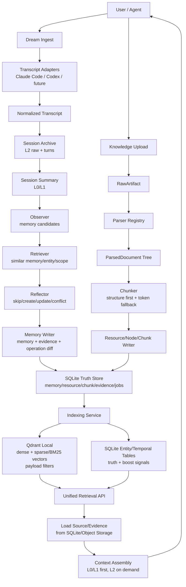

# 个人记忆 + 知识库系统调研与实现方案

调研日期：2026-06-08  
交付物：调研分析 + 架构方案 + 可执行实现方案  
目标系统：个人长期记忆与个人知识库，支持从 Claude Code / Codex 等对话记录中生成记忆，并支持任意格式文档上传、解析、索引与检索。

## 0. 结论摘要

推荐方案不是单纯复制某个项目，而是以 **OpenViking 的上下文数据库思想作为主干**，组合 mem0、Graphiti、Khoj、AnythingLLM、Open WebUI 的优点：

1. **基座选择**：个人自用或开源自托管优先选 OpenViking 作为改造基座，因为它已经覆盖 Resource / Memory / Skill、L0/L1/L2 分层、session commit、Claude Code / Codex 插件经验。注意它是 AGPL-3.0，若未来闭源或商业分发，需要改用“mem0 + Graphiti + 自研文档 pipeline”的 permissive 路线。
2. **Dream 入口**：采用“读取 transcript -> 标准化会话 -> commit archive -> 生成 summary -> 抽取候选记忆 -> 去重/反思 -> 写入 diff”的异步流水线。不要边读日志边直接写长期记忆。
3. **知识上传入口**：采用“RawArtifact -> Parser Registry -> ParsedDocument/Node/Chunk -> L0/L1 语义层 -> Qdrant dense+sparse/BM25 + metadata payload 索引”的分层流水线。上传请求只创建任务，解析、摘要、embedding 后台执行。
4. **检索层**：Qdrant local 作为统一检索引擎，同时管理 memory 与 resource 的 dense vectors、sparse/BM25 vectors 和 payload filters；SQLite 只做事实库、任务库、审计库和索引映射，不做 SQLite FTS5 检索兜底。
5. **治理底线**：所有自动记忆必须有证据、状态、来源、scope、访问日志和删除/归档能力。自动记忆如果不可追溯，长期会污染系统。

最终 MVP 闭环：

```text
Claude/Codex transcript scan
  -> session archive
  -> evidence-backed memory
  -> hybrid retrieval

Document upload
  -> parsed chunks with source pointer
  -> Qdrant dense+sparse hybrid index
  -> retrieval with citations
```

## 1. 目标与范围

### 1.1 功能目标

1. **Dream 记忆写入入口**
   - 读取 Claude Code / Codex 的本地对话记录。
   - 预留 Cursor、Windsurf、OpenCode、ChatGPT export、自定义 JSONL/Markdown transcript adapter。
   - 对会话进行分析、总结、抽取，生成长期记忆。
   - 每条记忆可回溯到会话、turn、原始 transcript。

2. **知识上传入口**
   - 用户上传任意格式文档、链接或 raw text。
   - 解析成结构化文档树和 chunk。
   - 支持 embedding、Qdrant sparse/BM25、metadata filter、来源定位。
   - 支持删除、重建、增量同步。

3. **统一检索与上下文注入**
   - 同时搜索 memory 与 knowledge。
   - 支持 global/workspace/session/agent scope。
   - 返回可解释分数和证据来源。

### 1.2 非目标

1. 首版不追求解析所有格式到满分质量；先覆盖常见文本类与 Office/PDF。
2. 首版不做完整知识图谱 UI；Graphiti 作为长期演进方向或局部模块。
3. 首版不让 LLM 无限制覆盖、删除长期记忆；高风险操作进入 pending review。
4. 首版不把向量库当内容真源；Qdrant 只存检索索引和可过滤 payload，不存唯一原文。

## 2. 调研范围与本地证据

本次参考 6 个项目，其中 mem0、OpenViking、Khoj、AnythingLLM 是指定项目，Open WebUI 与 Graphiti 是额外 clone 的补充项目。

| 项目 | 本地路径 | 本地 commit | License | 主要参考价值 |
|---|---:|---:|---|---|
| mem0 | `research_repos/mem0` | `36694596` | Apache-2.0 | 事实型长期记忆、ADD-only、实体链接、BM25/向量/实体融合检索、OpenMemory 治理 |
| OpenViking | `research_repos/OpenViking` | `58ff0290` | AGPL-3.0 | Resource/Memory/Skill 上下文模型、L0/L1/L2、session commit、memory_diff、Claude/Codex 插件 |
| Khoj | `research_repos/khoj` | `9258f57` | AGPL-3.0-or-later | personal second brain、文档 Entry、增量 hash、文件/日期/词过滤、用户 memory 开关 |
| AnythingLLM | `research_repos/anything-llm` | `c7790ce` | MIT | collector/server 分层、document JSON 中间层、docId/vectorId、vector-cache、Observer/Reflector memory job |
| Open WebUI | `research_repos/open-webui` | `02dc3e6` | Open WebUI License | 用户可控 memory 工具、知识库 ACL、RAG + BM25 + rerank 产品形态、agentic knowledge tools |
| Graphiti | `research_repos/graphiti` | `ff7e29c` | Apache-2.0 | Zep 系时序知识图谱、episode provenance、事实有效期、semantic + BM25 + graph traversal |

外部参考：

1. [mem0 GitHub](https://github.com/mem0ai/mem0) 说明其 2026-04 新算法采用单次 ADD-only 抽取、实体链接、多信号检索和时间推理。
2. [OpenViking GitHub](https://github.com/volcengine/OpenViking) 说明它是面向 Agent 的 context database，并给出 memory、experience、knowledge-base QA 评测。
3. [Khoj GitHub](https://github.com/khoj-ai/khoj) 将 Khoj 定位为 personal AI second brain，支持 docs、web、多端入口和自托管。
4. [AnythingLLM GitHub](https://github.com/Mintplex-Labs/anything-llm) 说明其 monorepo 分为 frontend、server、collector、docker、embed、browser-extension，collector 专门解析 UI 上传文档。
5. [Open WebUI Knowledge docs](https://docs.openwebui.com/features/workspace/knowledge/) 说明 Knowledge 使用 RAG 按需检索 chunk，支持 PDF、spreadsheet、code、文本文件、BM25、rerank、多种 extraction engines。
6. [Open WebUI Memory docs](https://docs.openwebui.com/features/chat-conversations/memory/) 说明其 memory 是用户可见、可手动管理，也可由 Native Tool Calling 主动 add/search/replace/delete/list。
7. [Graphiti GitHub](https://github.com/getzep/graphiti) 说明其 context graph 跟踪事实变化、保留 provenance，并融合 semantic、BM25、graph traversal。
8. [Zep Community Edition 公告](https://blog.getzep.com/announcing-zep-community-edition/) 说明 Zep CE 使用 Graphiti，从聊天、工具调用、业务数据中增量构建 temporal graph memory。
9. [Qdrant Hybrid Queries docs](https://qdrant.tech/documentation/search/hybrid-queries/) 说明 Qdrant Query API 支持 dense 与 sparse 多路 prefetch，并可用 RRF/DBSF 做融合。
10. [Qdrant Hybrid Search tutorial](https://qdrant.tech/documentation/tutorials-basics/cloud-inference-hybrid-search/) 展示 dense embedding 与 sparse/BM25 embedding 的混合检索流程。
11. [SQLite FTS5 docs](https://www.sqlite.org/fts5.html) 说明 FTS5 是 SQLite 的全文检索虚拟表模块，并内置 `bm25()` 排序函数。
12. [SQLite WAL docs](https://www.sqlite.org/wal.html) 说明 WAL 支持读写并发，更适合作为本地应用的元数据与任务状态存储模式。

## 3. 横向调研结论

### 3.1 mem0

可借鉴：

1. **事实型 memory**：memory 是短事实，不是整段摘要。
2. **ADD-only 首版策略**：先追加与去重，避免模型误覆盖旧事实。
3. **实体链接**：人、项目、工具、文件、组织都成为检索信号。
4. **混合检索**：semantic、BM25 keyword、entity boost 并行打分再融合。
5. **OpenMemory 治理**：memory state、app/source、status history、access log。

不宜照搬：

1. 只存短事实而不存原始证据；Dream 必须保留 transcript archive 与 turn 引用。
2. 只用 user/agent/run scope；本系统还需要 source_app、workspace、project_path、repo、session_id。
3. 完全 ADD-only；首版可以 ADD-first，但要预留 update/conflict/review。

### 3.2 OpenViking

可借鉴：

1. **统一上下文类型**：Resource、Memory、Skill 三类上下文非常贴合本目标。
2. **L0/L1/L2 渐进加载**：L0 摘要用于召回，L1 概览用于 rerank/导航，L2 原文按需加载。
3. **Resource pipeline**：Source Input -> Parse -> Tree Build -> Persistence -> Semantic Processing。
4. **Session commit**：会话先归档，再异步生成摘要、抽取长期记忆、写 `memory_diff.json`。
5. **Claude/Codex lifecycle**：Stop 适合增量 capture，PreCompact/idle/manual end 适合 commit。

不宜照搬：

1. 完整虚拟文件系统对 MVP 偏重；首版可用 SQL + object storage + URI 约定。
2. AGPL-3.0 对闭源商业分发有限制；要提前决定项目许可边界。

### 3.3 Khoj

可借鉴：

1. **个人 second brain 产品形态**：多端入口、自托管、用户知识库、agent scoping。
2. **Entry 模型**：raw、compiled、heading、file、uri 分离。
3. **结构优先切分**：Markdown heading、PDF page、DOCX loader，再 token fallback。
4. **增量索引**：hash 判断新增、更新、删除。
5. **过滤体验**：file filter、date filter、word filter 对个人知识库很关键。
6. **memory 开关**：server default + user preference，且按 user + agent scope。

不宜照搬：

1. memory 抽取较轻，不足以承担 Dream 的自动长期记忆。
2. chunk 策略偏短，开发会话和设计文档需要更灵活 token window。

### 3.4 AnythingLLM

可借鉴：

1. **collector/server 分层**：collector 解析文档，server 管 workspace、向量库、LLM、memory。
2. **document JSON 中间层**：解析产物可审计、可重试、可重新向量化。
3. **任意格式入口**：扩展名、MIME、文本 fallback、OCR fallback。
4. **docId -> vectorId 映射**：删除或重建文档时可以精确删除 vectors。
5. **vector-cache**：避免重复 embedding。
6. **workspace document 管理**：pinned、watched、workspace relation。
7. **Observer/Reflector memory job**：先抽候选，再结合已有 memory 去重、分类、过滤。

不宜照搬：

1. memory 更偏 prompt 注入，检索融合不如 mem0。
2. GLOBAL/WORKSPACE 上限适合作为 prompt 注入上限，不适合作为存储上限。

### 3.5 Open WebUI

可借鉴：

1. **用户可见 memory 工具**：add/search/replace/delete/list 五个操作很适合作为治理 API。
2. **memory 权限开关**：全局 ENABLE + 用户/权限控制。
3. **每用户向量集合**：`user-memory-<user_id>` 模式能避免跨用户污染。
4. **知识库 ACL 与目录**：knowledge、knowledge_file、knowledge_directory、access_grants。
5. **agentic knowledge tools**：模型可以 list/search/view/grep/query 知识库，不只被动 RAG。
6. **Knowledge docs 产品边界**：RAG 用于大文档按需检索，Full Context 用于需要逐字精确的文档。

不宜照搬：

1. memory 表过于简单，缺证据、状态、scope、operation diff。
2. 如果让模型直接 replace/delete，需要更强审计与 review。
3. Open WebUI License 不是宽松开源许可，作为基座要审慎。

### 3.6 Graphiti / Zep

可借鉴：

1. **episode provenance**：原始 episode 是真源，实体/关系/事实都能追溯。
2. **时序事实**：事实有 valid_at / invalid_at，而不是简单覆盖。
3. **增量图构建**：新 episode 进入后解析实体、边、失效旧边，不需要全量重算。
4. **混合检索**：semantic + BM25 + graph traversal，并支持 RRF、node distance、cross-encoder 等 reranker。
5. **custom ontology**：可按个人/项目定义实体类型和关系类型。

不宜首版直接作为唯一基座：

1. 需要图数据库或图后端，运维复杂度高。
2. 它不自带用户、会话、上传、UI、权限治理，需要外围系统。
3. 对普通文档知识库，图谱可作为增强层，不应替代 chunk/RAG 基础设施。

## 4. 推荐总体架构



核心原则：

1. **原始证据先落库**：transcript、上传文件、链接抓取结果先保存为 RawArtifact。
2. **解析与语义分离**：parser 不调用 LLM；摘要、embedding、实体抽取走异步 job。
3. **内容与索引分离**：SQLite/object storage 是真源，Qdrant dense+sparse hybrid 是检索索引；命中后回 SQLite 加载 source/evidence。
4. **统一 URI**：任何 memory/resource/session/chunk 都有稳定 URI。
5. **先可控，再自动化**：自动写入默认可审计、可撤销、可暂停。

## 5. 基座改造方案

### 5.1 推荐基座：OpenViking

适用场景：

1. 个人自用、自托管、开源发布。
2. 重点是 Claude Code / Codex 记忆与上下文系统。
3. 可以接受 AGPL-3.0。

改造方向：

1. **保留**
   - Resource/Memory/Skill 上下文类型。
   - L0/L1/L2 层级。
   - session commit 与 archive。
   - Claude Code / Codex 插件生命周期经验。

2. **新增**
   - Dream 离线 scanner：即使 hook 丢失，也能扫描 transcript 真源。
   - memory governance API：active/pending/paused/archived/deleted、review queue、access log。
   - mem0-style scoring：Qdrant semantic+sparse hybrid + entity boost + temporal boost。
   - AnythingLLM-style document JSON 中间层和 docId/vectorId 映射。
   - Open WebUI-style memory tools：list/search/add/replace/delete，但危险操作要有审计。

3. **延后**
   - 完整图谱记忆：先做 entity index 和 conflict detection，后续引入 Graphiti。
   - 完整可视化 UI：先 API + minimal admin/review UI。

### 5.2 备选基座：Permissive 组合

适用场景：

1. 需要闭源或商业化分发。
2. 不希望受 AGPL / Open WebUI License 限制。

组合：

1. mem0：记忆抽取与混合检索算法参考或局部依赖。
2. Graphiti：时序图谱增强，Apache-2.0。
3. AnythingLLM：文档 pipeline 参考，MIT。
4. 自研 FastAPI/Next.js/SQLite-first 外围系统，Postgres 只作为未来迁移选项。

结论：如果当前目标是“尽快做出个人系统”，OpenViking 路线更快；如果目标包含“可闭源分发”，选择 permissive 组合。

## 6. 核心数据模型

### 6.1 Source 与原始证据

| 表/对象 | 关键字段 | 说明 |
|---|---|---|
| `source_app` | `id`, `name`, `type`, `enabled`, `config`, `created_at` | Claude Code、Codex、future adapter |
| `raw_artifact` | `id`, `source_app_id`, `kind`, `uri`, `checksum`, `mime`, `size`, `metadata`, `created_at` | transcript、上传文件、链接抓取结果 |
| `ingest_job` | `id`, `artifact_id`, `pipeline`, `status`, `stage`, `attempts`, `error`, `started_at`, `finished_at` | 解析、抽取、索引任务 |
| `sync_cursor` | `id`, `source_app_id`, `cursor_json`, `last_seen_at`, `updated_at` | adapter 增量扫描状态 |

### 6.2 Dream 会话

| 表/对象 | 关键字段 | 说明 |
|---|---|---|
| `conversation_session` | `id`, `source_app_id`, `external_session_id`, `project_path`, `repo`, `started_at`, `ended_at`, `status`, `metadata` | 外部会话映射 |
| `conversation_turn` | `id`, `session_id`, `external_turn_id`, `role`, `content`, `parts_json`, `created_at`, `token_count`, `raw_ref`, `hash` | 标准化 turn |
| `session_archive` | `id`, `session_id`, `archive_no`, `raw_uri`, `l0_abstract`, `l1_overview`, `committed_at`, `commit_reason` | commit 边界 |

### 6.3 Memory

| 表/对象 | 关键字段 | 说明 |
|---|---|---|
| `memory` | `id`, `scope`, `workspace_id`, `category`, `content`, `status`, `confidence`, `valid_at`, `invalid_at`, `created_at`, `updated_at`, `last_used_at` | 长期记忆 |
| `memory_evidence` | `memory_id`, `session_id`, `turn_id`, `artifact_id`, `quote_ref`, `confidence` | 来源证据 |
| `memory_entity` | `memory_id`, `entity_text`, `entity_type`, `normalized`, `canonical_id` | 实体链接 |
| `memory_operation` | `id`, `archive_id`, `op`, `memory_id`, `before_json`, `after_json`, `reasoning`, `actor`, `created_at` | diff、审计、回滚 |
| `memory_access_log` | `id`, `memory_id`, `request_id`, `query`, `used_in_response`, `created_at` | 访问审计 |

Memory scope：

| scope | 含义 | 示例 |
|---|---|---|
| `global` | 跨项目长期适用 | 用户偏好中文、喜欢先给结论 |
| `workspace` | 某项目/目录适用 | 当前项目用 Next.js + Prisma |
| `session` | 某次会话短期适用 | 本轮尚未完成的 TODO |
| `agent` | 某 agent 的工具经验 | Codex 在该 repo 用 `pnpm test` 验证 |

Memory category：

| category | 说明 | 更新策略 |
|---|---|---|
| `profile` | 用户身份、角色、长期背景 | 可合并 |
| `preference` | 表达、技术、工作流偏好 | 可合并 |
| `entity` | 人、项目、库、系统、文件事实 | 追加/合并 |
| `event` | 决策、里程碑、发生过的事 | 追加，默认不覆盖 |
| `procedure` | 可复用工作流、命令、项目惯例 | 可合并 |
| `lesson` | 解决问题后的经验 | 可合并 |

### 6.4 Resource / Knowledge

| 表/对象 | 关键字段 | 说明 |
|---|---|---|
| `workspace` | `id`, `name`, `root_path`, `metadata` | 项目或知识空间 |
| `resource` | `id`, `workspace_id`, `artifact_id`, `title`, `source_uri`, `mime`, `checksum`, `status`, `metadata` | 上传文档或链接 |
| `resource_node` | `id`, `resource_id`, `parent_id`, `node_type`, `title`, `path`, `l0_abstract`, `l1_overview`, `order_no` | 文档结构树 |
| `chunk` | `id`, `resource_id`, `node_id`, `text`, `compiled_text`, `page`, `line_start`, `line_end`, `token_count`, `hash` | 检索最小单元 |
| `vector_index_item` | `id`, `target_type`, `target_id`, `vector_id`, `index_name`, `embedding_model`, `created_at` | 支持删除、重建、迁移 |
| `resource_acl` | `resource_id`, `subject_type`, `subject_id`, `permission` | 用户、组、agent 权限 |

## 7. Dream 入口实现方案

### 7.1 Adapter 接口

```python
class TranscriptAdapter:
    source_app: str

    def detect(self) -> bool: ...
    def list_sessions(self, cursor: dict) -> list[ExternalSession]: ...
    def read_turns(self, session: ExternalSession, cursor: dict) -> list[RawTurn]: ...
    def normalize_turn(self, raw: RawTurn) -> ConversationTurn: ...
```

首版 adapter：

1. `ClaudeCodeTranscriptAdapter`
2. `CodexTranscriptAdapter`

预留 adapter：

1. Cursor / Windsurf / OpenCode
2. ChatGPT export
3. 自定义 JSONL / Markdown transcript
4. MCP/hook 实时写入

### 7.2 Dream pipeline

```text
scan adapters
  -> skip unchanged transcript by sync_cursor
  -> detect new/changed sessions
  -> normalize turns
  -> persist raw transcript + turns
  -> if session idle/closed/manual/compact:
       create session_archive
       generate L0/L1 session summary
       observer extracts candidates
       retrieve similar memories/entities
       reflector decides skip/create/update/conflict
       write memory + evidence + operation diff
       index memory
```

触发策略：

| 触发 | 行为 |
|---|---|
| hook Stop | 只 capture 新 turn，不立刻做昂贵抽取 |
| hook PreCompact | 同步 commit，避免上下文被压缩前丢失 |
| idle TTL | 会话超过阈值未更新后后台 commit |
| manual Dream | 用户手动触发某个 session 或时间范围归档 |
| startup sweep | 启动时扫描 orphan session，补 commit |

### 7.3 Observer / Reflector

Observer 输入：

1. session L1 summary。
2. 最近 N 个 turn。
3. 文件/工具调用摘要。
4. 项目路径、repo、source_app、日期。

Observer 输出：

```json
{
  "candidates": [
    {
      "content": "用户偏好先给结论再展开分析。",
      "category": "preference",
      "scope_hint": "global",
      "confidence": 0.86,
      "evidence_turn_ids": ["turn_123"],
      "reasoning": "用户多次明确要求先给结论。"
    }
  ]
}
```

Reflector 输入：

1. candidate。
2. 相似 memory topK。
3. 同实体 memory。
4. 同 workspace/session memory。
5. policy：敏感类别、最小 confidence、scope 规则。

Reflector 输出：

| action | 含义 |
|---|---|
| `skip` | 已有或不值得保存 |
| `create` | 新记忆 |
| `update` | 合并到已有记忆 |
| `conflict` | 与旧记忆冲突，进入 review |
| `pending` | 低置信度或敏感，等待人工确认 |

默认策略：

1. 每个 archive 最多自动创建 5-10 条 memory。
2. assistant-only 内容不写用户 profile/preference；LLM observer 会要求用户事实至少有一个 user/human evidence。
3. 涉及密钥、财务、健康、身份、客户隐私默认 pending。
4. 所有 create/update/delete 都写 `memory_operation`。
5. assistant/tool-only evidence 只允许生成 procedure、lesson 或 agent scope 经验。

## 8. 知识上传入口实现方案

### 8.1 Upload pipeline

```text
upload file/link/raw text
  -> save RawArtifact
  -> MIME detect + parser selection
  -> parse to ParsedDocument tree
  -> structural chunking
  -> hash diff / dedup
  -> write Resource/Node/Chunk
  -> async L0/L1 generation
  -> embedding + sparse/BM25 + payload/entity index
  -> status ready
```

### 8.2 Parser registry

| 类型 | 首版 parser | 后续增强 |
|---|---|---|
| Markdown / MDX | heading tree | frontmatter、wiki links |
| TXT / unknown text | encoding detect + recursive split | language detection |
| PDF | PyMuPDF/pdfplumber | OCR、table extraction |
| DOCX / PPTX / XLSX | python-docx / python-pptx / openpyxl | 表格结构、图片 OCR |
| HTML / URL | readability + markdown | boilerplate removal |
| Code repo | gitignore-aware walker + symbol skeleton | AST graph |
| Image | OCR/VLM caption | layout detection |
| Audio/Video | transcription | timestamps + speaker diarization |

### 8.3 Chunk 策略

1. 结构优先：heading、page、slide、sheet、section、code symbol。
2. 超长再 token fallback：默认 500-1200 tokens，按类型配置 overlap。
3. `compiled_text` 包含文件名、章节路径、页码/行号，提高 embedding 可检索性。
4. 每个 chunk 保留 source pointer：file path、page、line、URL fragment、timestamp。
5. chunk hash 支持增量更新和删除旧索引。

### 8.4 索引策略

| 索引 | 作用 |
|---|---|
| dense vector | 语义召回，写入 Qdrant local |
| sparse/BM25 vector | 人名、项目名、代码符号、错误信息等精确词汇召回，写入 Qdrant local |
| metadata payload | workspace、source、file_type、date、tag、status，作为 Qdrant payload filter，同时在 SQLite 保留真源字段 |
| entity index | memory 与 resource chunk 共用实体信号；实体真源在 SQLite，检索 boost 可进入 payload 或 rerank |
| temporal index | valid_at、invalid_at、created_at、updated_at；时间真源在 SQLite，检索过滤字段同步到 Qdrant payload |
| graph index | 后续 Graphiti 增强，处理关系和时序冲突 |

首版不建立 SQLite FTS5 主检索链路，也不做 FTS5 兜底。BM25/sparse 的召回入口统一放在 Qdrant，SQLite 只负责保存文本真源、索引映射和可重建索引所需的数据。

## 9. 统一检索 API

### 9.1 检索流程

```text
retrieve(query, target_types, scope, filters, mode)
  -> normalize query
  -> optional intent planning
  -> build dense query vector
  -> build sparse/BM25 query vector
  -> Qdrant hybrid query with payload filters
  -> optional entity/time/source boost
  -> optional rerank
  -> load source/evidence from SQLite/object storage
  -> progressive load L0/L1/L2
  -> return contexts with evidence
```

### 9.2 结果对象

| 字段 | 说明 |
|---|---|
| `id` | memory_id / chunk_id / node_id |
| `type` | memory/resource/session/skill |
| `scope` | global/workspace/session/agent |
| `score` | 融合分 |
| `score_details` | qdrant_hybrid/semantic/BM25/entity/recency/rerank |
| `content` | 注入模型的文本，优先 L0/L1 |
| `source` | 文件、会话、turn、URL |
| `evidence` | 可点击或可读取的证据引用 |
| `load_more_uri` | 需要 L2 时读取 |

### 9.3 API 草案

```http
POST /api/dream/scan
POST /api/dream/sessions/{id}/commit
GET  /api/dream/sessions
GET  /api/dream/sessions/{id}/archive/{archive_no}

POST /api/memories
GET  /api/memories
POST /api/memories/search
PATCH /api/memories/{id}
DELETE /api/memories/{id}
GET  /api/memories/{id}/evidence
GET  /api/memories/operations

POST /api/resources/upload
GET  /api/resources
GET  /api/resources/{id}
DELETE /api/resources/{id}
POST /api/resources/{id}/reindex

POST /api/retrieve
```

## 10. Prompt 与写入策略

### 10.1 Memory 写入规则

系统提示要明确：

1. 只保存对未来有用的信息。
2. 不保存普通闲聊、一次性任务细节、模型猜测。
3. 区分用户事实、项目事实、agent 工作流经验。
4. 不把 assistant 的建议当成用户事实。
5. 每条候选必须指向 evidence turn。
6. 相对时间必须转绝对日期。
7. 敏感内容不要自动 active，进入 pending。

### 10.2 冲突策略

| 情况 | 处理 |
|---|---|
| 新事实与旧事实完全重复 | skip |
| 新事实是旧事实补充 | create 或 update，保留 evidence |
| 新偏好替代旧偏好 | update，旧值写 operation before |
| 新事实否定旧事实 | conflict/pending，或写 invalid_at |
| 低置信度 | pending |

长期演进可以引入 Graphiti：把冲突从“覆盖文本”升级为“旧 fact invalid_at，新 fact valid_at”。

## 11. MVP 分阶段计划

### Phase 1：基础数据层与 Dream 扫描

范围：

1. 建立 `source_app`、`raw_artifact`、`conversation_session`、`conversation_turn`、`session_archive`。
2. 实现 Claude Code / Codex adapter。
3. 保存原始 transcript 和标准化 turns。
4. 支持手动 commit。
5. 文件级 `sync_cursor` 跳过未变化 transcript。
6. 已 committed session 追加新 turn 后重新变为 active，等待下一次 commit。

验收：

1. 能列出会话。
2. 能查看 turns 和 raw artifact。
3. 重复扫描不重复写入。
4. 未变化 transcript 会被跳过，并返回 `skipped_sessions`。

### Phase 2：Memory 抽取与治理

范围：

1. session L0/L1 summary。
2. Observer candidate extraction。
3. Reflector 去重、分类、scope 决策。
4. `memory`、`memory_evidence`、`memory_operation`。
5. status：active/pending/paused/archived/deleted。
6. LLM observer evidence role guard，避免 assistant-only claim 写成用户事实。

验收：

1. 每条 memory 能追溯到 session/turn。
2. 重复会话不会产生大量重复 memory。
3. 用户能删除、归档、停用 memory。
4. assistant-only 偏好/profile 候选不会进入长期 memory。

### Phase 3：知识上传与文档索引

范围：

1. RawArtifact + Resource/Node/Chunk。
2. Parser registry：txt/md/pdf/docx/html。
3. Chunk hash diff。
4. dense embedding + sparse/BM25 vector 写入 Qdrant local。
5. source pointer：file/page/line/url。

验收：

1. 上传文档后可看到解析状态。
2. 检索结果带来源。
3. 删除文档能删除相关 vectors。

### Phase 4：统一检索 API

范围：

1. Qdrant dense+sparse hybrid retrieval + metadata filters。
2. memory entity boost。
3. L0/L1/L2 progressive load。
4. score_details。

验收：

1. 能按 workspace/global 查询。
2. 能同时回答“我偏好什么”和“某文档怎么说”。
3. 检索结果可解释。

### Phase 5：自动化与图谱增强

范围：

1. hook 插件或 watcher。
2. idle/compact 自动 commit。
3. review queue。
4. Graphiti temporal fact layer。
5. 新 adapter SDK。

验收：

1. 正常使用 Claude/Codex 后无需手动导入。
2. 退出、崩溃、compact 有兜底提交。
3. 用户可按 source_app 暂停写入。

## 12. 技术选型建议

### 12.1 个人本地应用

| 层 | 推荐 |
|---|---|
| API | FastAPI |
| 元数据真源 | SQLite，不单独部署数据库服务 |
| 检索引擎 | Qdrant local，统一检索 memory 与 resource |
| Dense vector | Qdrant named dense vectors |
| Sparse/BM25 | Qdrant sparse vectors，不走 SQLite FTS5 |
| Object storage | 本地文件目录 |
| Queue | SQLite job table + 单后台 worker |
| Parser | PyMuPDF、python-docx、openpyxl、readability-lxml |
| UI | 简单 Web admin + review queue |

当前定位是个人应用且先不考虑多租户，因此元数据层推荐直接使用 SQLite。它不需要独立服务，部署形态就是一个本地 `.sqlite` 文件；配合 WAL、短事务、单后台写 worker，可以覆盖 Dream 扫描、文档解析任务状态、memory operation、resource/chunk 元数据、审计日志等需求。

检索层推荐直接使用 Qdrant local 统一管理 dense + sparse/BM25 hybrid retrieval。这里的“查询都用 Qdrant”指第一阶段召回、混合排序和 payload filter 都从 Qdrant 走；Qdrant 返回 `memory_id` / `chunk_id` / `node_id` 后，再回 SQLite 读取原文、证据、operation diff、source pointer 和权限状态。SQLite 不建立 FTS5 主检索链路，也不做检索兜底。Postgres、Tantivy、OpenSearch 都不作为首版目标，只保留未来迁移空间。

### 12.2 SQLite 与 Qdrant 职责边界

SQLite 是事实库，不是首版检索引擎：

| SQLite 保存 | 为什么必须保留 |
|---|---|
| `raw_artifact`、`conversation_turn`、`session_archive` | transcript、上传文件、解析产物的原始证据和 commit 边界 |
| `memory`、`memory_evidence`、`memory_operation`、`memory_access_log` | 记忆正文、证据、diff、审计、回滚和治理状态 |
| `resource`、`resource_node`、`chunk` | 文档结构、chunk 真文、source pointer、hash、删除与重建依据 |
| `ingest_job`、`sync_cursor`、`config` | Dream 扫描、解析、embedding、重试、增量同步状态 |
| `vector_index_item` | SQLite 目标对象与 Qdrant point/vector 的映射，支持删除、重建、迁移 |

Qdrant 是检索索引，不是事实库：

| Qdrant 保存 | 用途 |
|---|---|
| memory point | 长期记忆的 dense vector、sparse/BM25 vector、可过滤 payload |
| resource chunk point | 文档 chunk 的 dense vector、sparse/BM25 vector、可过滤 payload |
| named vectors | 同一个 point 同时承载 dense 与 sparse 表示，便于 hybrid query |
| payload | `target_type`、`target_id`、`workspace_id`、`source_app`、`status`、`created_at`、`tags` 等过滤字段 |
| score/result id | 返回候选 ID 和分数；最终内容、证据和权限状态仍以 SQLite 为准 |

写入顺序建议：

```text
write SQLite truth
  -> enqueue index job
  -> generate dense embedding + sparse/BM25 vector
  -> upsert Qdrant point with payload
  -> write vector_index_item
  -> mark job done
```

删除或重建时反向执行：先在 SQLite 标记状态并写 operation，再按 `vector_index_item` 删除 Qdrant point；如果 Qdrant 索引损坏，可以完全从 SQLite 与本地 artifact 目录重建。

### 12.3 为什么检索选择 Qdrant 而不是 SQLite FTS5

| 维度 | Qdrant local 统一检索 | SQLite FTS5 检索 |
|---|---|---|
| 语义检索 | 原生面向向量检索，适合 memory 与 chunk 的语义召回 | 不负责向量检索；需要另接向量库再做应用层融合 |
| BM25/sparse | 支持 sparse vectors，可与 dense vectors 在一个 Query API 中做 hybrid fusion | 内置 `bm25()`，关键词检索简单可靠 |
| 混合排序 | dense + sparse 可以在 Qdrant 内部用 RRF/DBSF 等方式融合，应用层只处理 rerank/boost | 需要分别查 FTS5 和向量库，再自己维护归一化、merge、dedup、权重 |
| 过滤能力 | payload filter 与检索同路，适合 workspace、source、status、时间等检索过滤 | SQL filter 很强，但一旦 dense 在 Qdrant、BM25 在 SQLite，过滤与排序会被拆成两套 |
| 架构边界 | Retrieval 统一归 Qdrant，SQLite 统一归 truth/audit/job，边界清楚 | 部署更简单，但 retrieval 变成 SQLite FTS5 + Qdrant dense 两条链路 |
| 调试与可解释 | 能返回 hybrid 分数和命中 point；需要回 SQLite 展示证据 | SQL、snippet、highlight、`bm25()` 调试更直观 |
| 本地部署 | 需要额外本地进程或容器，并维护 collection/schema | 无需额外服务，一个 `.sqlite` 文件即可 |
| 数据一致性 | 需要 `vector_index_item`、幂等 upsert/delete、reindex job 保证同步 | 元数据和 FTS 可同事务更新，一致性更自然 |
| 后续演进 | 更容易演进到 multivector、rerank、多 collection、Qdrant cloud/cluster | 适合作为本地全文检索，不适合作为长期 hybrid retrieval 中心 |

最终判断：

1. 本系统的核心检索对象是 memory 与 resource chunk，既需要“用户提过的精确项目名/文件名/错误码”，也需要“换一种说法还能搜到”的语义召回。Qdrant dense+sparse hybrid 更贴近这个主路径。
2. 即使 BM25 放 SQLite，系统也仍然需要 SQLite + Qdrant 两套数据；差异不在“是否多一个数据库”，而在“检索由一个引擎负责，还是由应用层融合两个引擎”。统一交给 Qdrant 后，复杂度集中在 sparse vector 生成、payload schema、index sync，这比长期维护两套召回结果的归一化和融合更干净。
3. SQLite 的优势不丢：它仍然是个人应用最合适的事实库、任务库、审计库和可重建索引的来源。只是它不承担首版 retrieval ranking。
4. 因此首版选择 Qdrant local 统一检索；SQLite FTS5 只作为被调研过的备选方案，不进入主链路，也不做兜底。

### 12.4 未来多用户/长期服务

| 层 | 推荐 |
|---|---|
| 元数据 | Postgres |
| 检索引擎 | Qdrant cluster/cloud |
| Sparse/BM25 | Qdrant sparse vectors；OpenSearch 仅作为超大规模全文检索或日志检索补充 |
| Object storage | S3-compatible |
| Queue | Celery/RQ + Redis |
| Graph | Graphiti + Neo4j/FalkorDB |
| 安全 | envelope encryption、ACL、audit log |

## 13. 风险与控制

| 风险 | 说明 | 控制 |
|---|---|---|
| 自动记忆污染 | LLM 写入临时信息、误解或助手输出 | evidence、confidence、pending review、敏感过滤 |
| 重复与矛盾 | ADD-only 会累积近似重复或旧事实 | hash + embedding dedup + entity conflict + invalid_at |
| 隐私与安全 | transcript 可能包含密钥、客户信息、路径 | secret scanner、source opt-out、加密、删除审计 |
| 任意格式解析成本 | OCR/表格/视频质量与成本不可控 | parser registry 分层、失败可重试、首版常见格式 |
| 检索不可解释 | 用户不信任记忆来源 | 必须返回 source/evidence/score_details |
| SQLite 与 Qdrant 同步漂移 | 删除、重建、embedding 失败可能导致孤儿 point 或漏索引 | SQLite-first 写入、`vector_index_item`、幂等 upsert/delete、reindex job |
| 过早复杂化 | 图谱/VFS/UI 一起做会拖慢 MVP | 先 SQL + URI + hybrid retrieval，再演进 |
| hook 生命周期不可靠 | 退出或崩溃不一定触发 hook | 本地 transcript scanner 作为真源，hook 只做增量 |
| 许可证风险 | OpenViking/Khoj 为 AGPL，Open WebUI 为专有样式 license | 自用可参考，商业化改用 permissive 组合 |

## 14. 最终推荐实现路线

建议采用两阶段基座策略：

1. **当前阶段用 OpenViking 做基座验证 MVP**
   - 直接复用其 session、L0/L1/L2、Resource/Memory/Skill 思想。
   - 复用 Claude Code / Codex 插件经验。
   - 新增 Dream scanner、memory governance、document JSON、hybrid scoring。
   - 元数据层默认使用 SQLite，本地文件目录保存 raw artifact 和 parsed artifact。
   - Qdrant local 统一检索 memory/resource 的 dense + sparse/BM25 vectors；SQLite 不做 FTS5 检索兜底。

2. **如果要闭源或商业化，抽象成独立核心**
   - 将 OpenViking 作为设计参考，不作为运行时依赖。
   - 核心使用 Apache/MIT 组件：mem0、Graphiti、AnythingLLM 思路或局部代码。
   - 自研数据模型和 API，避免 license 传染。

最终架构关键词：

```text
Evidence-first
Session-commit memory
Resource/Memory unified context
L0/L1/L2 progressive loading
Hybrid retrieval
Qdrant dense+sparse retrieval
User-visible governance
Adapter-based Dream ingest
Parser-registry knowledge ingest
```

这个方案的关键不是“记住更多”，而是“记住得可验证、可撤销、可检索、可演进”。个人记忆系统一旦能守住这四点，后续接入更多 agent、更多文件格式、更多同步源都会比较自然。
