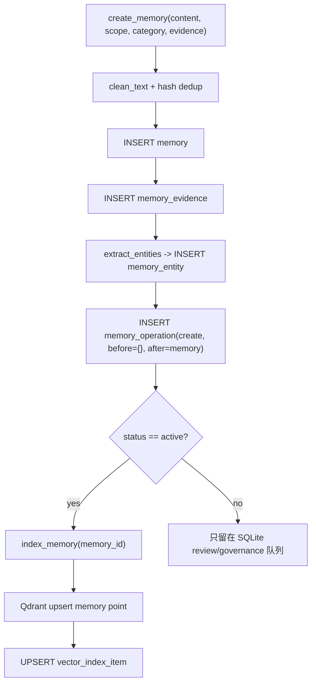
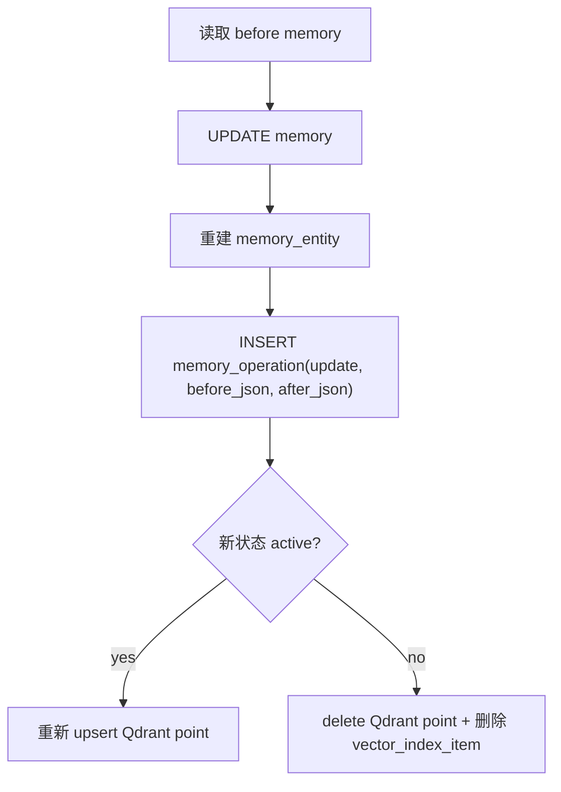
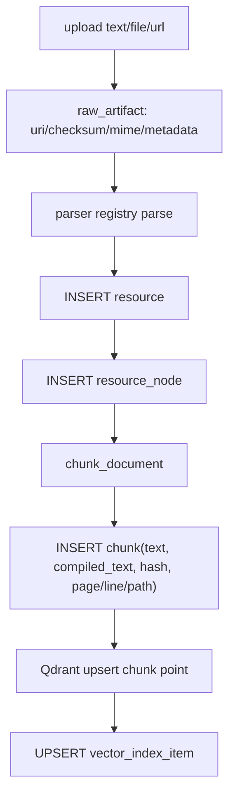
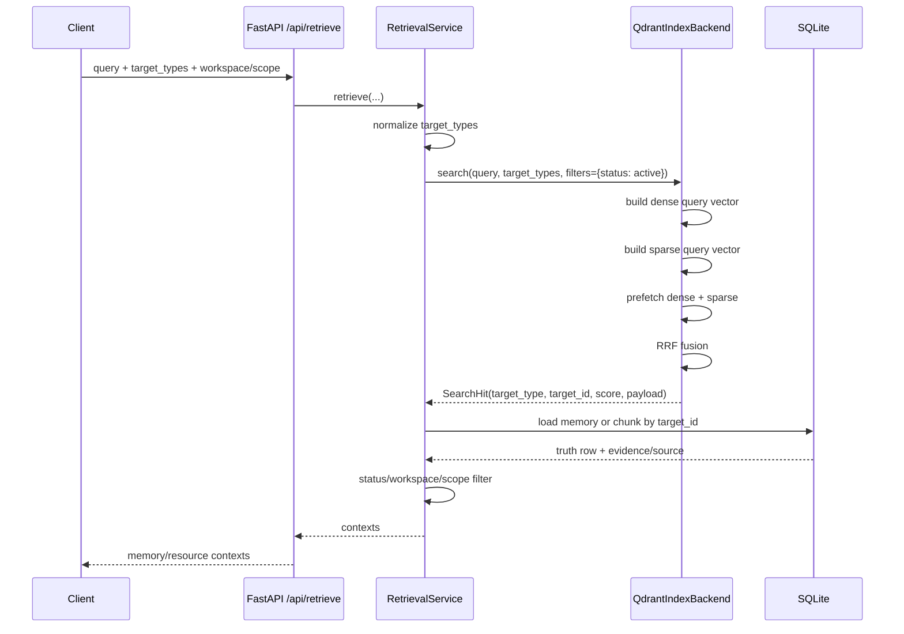
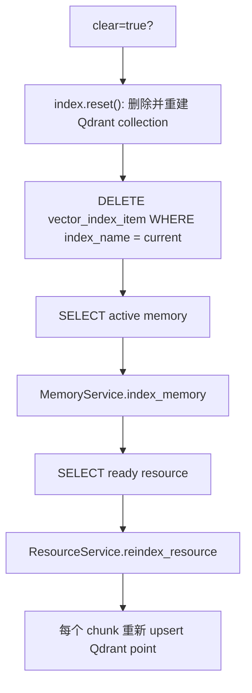

# 统一检索实现说明

本文说明 BHD Memory 里“SQLite 保存事实、证据、operation diff；本机 Qdrant 保存 dense + sparse 向量索引”这一条主链路是怎么实现的。

核心原则很简单：

1. SQLite 是 truth store。凡是不能丢、需要审计、需要回滚、需要重建索引的数据，都落在 SQLite。
2. Qdrant 是 retrieval index。它只保存可重建的向量 point、检索 payload 和分数，不作为事实库。
3. 查询先走 Qdrant 召回候选，再回 SQLite 校验状态、权限边界、scope/workspace，并加载正文与证据。

## 代码入口

| 模块 | 作用 |
|---|---|
| `src/bhd_memory/database.py` | SQLite schema、连接、WAL、迁移 |
| `src/bhd_memory/indexing/qdrant.py` | Qdrant collection、dense/sparse named vectors、hybrid search |
| `src/bhd_memory/indexing/embeddings.py` | 当前 MVP 的 deterministic dense/sparse embedding 生成 |
| `src/bhd_memory/memory.py` | memory fact、evidence、operation diff 写入与索引 |
| `src/bhd_memory/resources.py` | resource/artifact/node/chunk 写入与 chunk 索引 |
| `src/bhd_memory/retrieval.py` | 统一检索：Qdrant 召回 + SQLite 加载 |
| `src/bhd_memory/maintenance.py` | 从 SQLite truth store 重建 Qdrant 索引 |
| `src/bhd_memory/api/app.py` | `/api/retrieve`、memory、resource、rebuild API |

## 存储边界

### SQLite 保存什么

SQLite 的 schema 定义在 `database.py`。跟统一检索直接相关的表有：

| 表 | 保存内容 | 为什么放 SQLite |
|---|---|---|
| `memory` | 长期记忆事实：scope、workspace、category、content、status、confidence、valid_at、invalid_at | 这是记忆事实本体，需要可治理、可审计 |
| `memory_evidence` | memory 的来源证据：session、turn、artifact、quote_ref、confidence | 让每条记忆能追溯来源 |
| `memory_operation` | create/update/invalidate/delete 等操作 diff：before_json、after_json、reasoning、actor | 支持审计、回滚、Review queue 解释 |
| `memory_entity` / `memory_relation` | 简单实体和 supersedes 等关系 | 用于冲突处理、图谱同步、未来 boost |
| `raw_artifact` | 上传文件、URL 抓取、transcript archive 等原始 artifact 指针与 checksum | 原始材料是可重建资源的基础 |
| `resource` | 知识资源元数据：title、source_uri、mime、checksum、status | 知识库资源事实 |
| `resource_node` | 文档结构节点：章节、路径、摘要 | 保留文档结构 |
| `chunk` | 检索 chunk 的原文、compiled_text、page、line、hash | Qdrant 命中后回表加载正文 |
| `vector_index_item` | SQLite target 到 Qdrant point 的映射 | 删除、重建、迁移、排查索引漂移 |
| `memory_access_log` | 检索命中 memory 时的访问日志 | 记录召回与使用情况 |
| `ingest_job` | 异步解析、Dream、reindex 任务状态 | 本地队列，不需要独立服务 |

SQLite 连接会开启：

```python
PRAGMA foreign_keys = ON
PRAGMA journal_mode = WAL
PRAGMA busy_timeout = 5000
```

这让本地应用能用一个 `.sqlite` 文件承载事实、任务和审计数据。

### Qdrant 保存什么

Qdrant collection 由 `QdrantIndexBackend.ensure_ready()` 创建：

```python
vectors_config={
    "dense": models.VectorParams(size=embedding_dim, distance=models.Distance.COSINE)
},
sparse_vectors_config={
    "sparse": models.SparseVectorParams(index=models.SparseIndexParams(on_disk=False))
}
```

每个 point 同时有两个 named vector：

| vector | 用途 |
|---|---|
| `dense` | 语义近似召回。当前 MVP 使用 deterministic hash dense embedding，默认维度 384 |
| `sparse` | 关键词/符号召回。当前 MVP 将 token hash 到 Qdrant sparse vector 维度 |

Qdrant payload 只保存检索和过滤所需字段，例如：

| target_type | payload 示例 |
|---|---|
| `memory` | `scope`、`workspace_id`、`category`、`status`、`created_at`、`updated_at` |
| `chunk` | `workspace_id`、`resource_id`、`resource_title`、`resource_status`、`mime`、`path`、`page`、`status` |

payload 里还会加通用字段：

```python
target_type
target_id
embedding_model
content_preview
```

注意：`content_preview` 只是调试预览，最终正文仍以 SQLite 的 `memory.content` 或 `chunk.compiled_text` 为准。

## 写入链路

### 写入 memory

用户通过 API、CLI、Dream commit 或 hook 创建 memory 时，主流程在 `MemoryService.create_memory()`：



几个关键点：

1. 去重使用 `scope + workspace_id + category + content` 的规范化 hash。
2. evidence 会写入 `memory_evidence`，可以关联会话 turn、artifact 或 quote。
3. 每次创建写一条 `memory_operation`，`before_json` 是 `{}`，`after_json` 是创建后的 memory。
4. 只有 `active` 状态会写入 Qdrant。`pending`、`conflict`、`paused` 等状态先留在 SQLite。

更新 memory 走 `MemoryService.update_memory()`：



删除不是直接删行，而是软删除：

```python
delete_memory(...) -> update_memory(status="deleted", reasoning="soft delete")
```

这样事实、证据和 diff 仍然留在 SQLite，Qdrant 中对应 point 会被删除。

### 写入 resource/chunk

知识入口由 `ResourceService` 负责，支持文本、文件、URL：



`resource` 和 `chunk` 是知识库的 truth。Qdrant point 的 `target_type` 是 `chunk`，因为真正参与检索的是 chunk，而不是整个 resource。

删除 resource 时：

1. `resource.status` 更新为 `deleted`。
2. 遍历该 resource 的所有 chunk。
3. 删除 Qdrant 中的 `chunk` point。
4. 删除对应 `vector_index_item`。

## 向量生成

当前实现没有依赖外部 embedding 服务，而是用本地 deterministic hash embedding，便于 MVP、测试和离线运行。

### Dense

`dense_hash_embedding(text, dim=384)`：

1. 用 `word_tokens()` 分词。
2. 每个 token 经过 SHA-256 得到稳定整数。
3. token hash 映射到 `[0, dim)` 的位置。
4. 根据 hash 的某一位决定加 `+1` 还是 `-1`。
5. 最后 L2 normalize。

这提供了稳定、可重建的 dense 向量。后续如果接真实 embedding 模型，只需要替换 `IndexBackend.upsert/search` 前的 embedding 生成策略，并更新 `embedding_model`。

### Sparse

`sparse_token_embedding(text)`：

1. 用 `word_tokens()` 分词。
2. 每个 token hash 到 Qdrant sparse vector 的 unsigned integer 维度。
3. 统计 token count。
4. value 使用 `sqrt(count)`，再做 L2 normalize。

这条 sparse 通道负责补足项目名、文件名、错误码、代码符号、专有名词等关键词召回。首版没有用 SQLite FTS5 作为主检索链路。

## Qdrant point ID 与索引映射

Qdrant point id 是确定性的：

```python
uuid.uuid5(uuid.NAMESPACE_URL, f"bhd:{target_type}:{target_id}")
```

因此同一个 `target_type + target_id` 反复 upsert 会覆盖同一个 point，不会产生重复 point。

SQLite 的 `vector_index_item` 同步记录：

```text
target_type
target_id
vector_id
index_name
embedding_model
created_at
```

这个表的价值是：

1. 删除时知道 SQLite 对象对应哪个向量索引。
2. 重建时可以清理旧 index mapping。
3. 排查 Qdrant 与 SQLite 是否漂移。
4. 将来更换 embedding model 或 index_name 时可以并行迁移。

## 查询链路

统一检索 API 是：

```http
POST /api/retrieve
```

最终进入 `RetrievalService.retrieve()`：



`target_types` 会被统一归一化：

| 输入 | 实际 Qdrant target |
|---|---|
| 空 | `memory` + `chunk` |
| `memory` / `session` | `memory` |
| `resource` / `knowledge` / `chunk` | `chunk` |

Qdrant 第一阶段会带 `status = active` payload filter，并取比用户 `limit` 更多的候选：

```python
limit=max(limit * 3, limit)
q_limit=max(limit * 4, 20)
```

这样做是为了给 SQLite 二次过滤留空间。

### Hybrid search

优先使用 Qdrant Query API：

```python
prefetch=[
    Prefetch(query=dense_query, using="dense", filter=query_filter, limit=q_limit),
    Prefetch(query=sparse_query, using="sparse", filter=query_filter, limit=q_limit),
],
query=FusionQuery(fusion=Fusion.RRF),
```

也就是 dense 和 sparse 两路召回，再用 RRF 做 rank fusion。

如果当前 Qdrant 版本不支持这套 Query API，代码会退回 `_fallback_two_pass()`：

1. 分别用 `dense` 和 `sparse` named vector 查询。
2. 应用层按 rank 做一个小的 RRF merge。
3. 返回同样的 `SearchHit` 结构。

## 回 SQLite 加载上下文

Qdrant 命中后不会直接把 payload 当最终答案，而是按 `target_type` 回 SQLite 加载。

### memory 命中

`_load_memory()` 会：

1. `SELECT * FROM memory WHERE id = ?`
2. 确认 `status == active`
3. 更新 `memory.last_used_at`
4. 写入 `memory_access_log`
5. 加载最多 5 条 `memory_evidence`
6. 返回统一 context：

```json
{
  "type": "memory",
  "content": "...",
  "scope": "...",
  "workspace_id": "...",
  "score": 0.123,
  "score_details": {"fusion": "rrf"},
  "source": {"kind": "memory", "memory_id": "..."},
  "evidence": [...],
  "load_more_uri": "memory://mem_xxx"
}
```

### chunk 命中

`_load_chunk()` 会：

1. join `chunk`、`resource`、`resource_node`
2. 确认 `resource.status == ready`
3. 返回 `chunk.compiled_text`
4. 附带 resource title、source_uri、path、page 等证据字段：

```json
{
  "type": "resource",
  "content": "...",
  "source": {
    "kind": "resource",
    "resource_id": "...",
    "title": "...",
    "uri": "...",
    "path": "...",
    "page": 1
  },
  "evidence": [
    {
      "resource_id": "...",
      "chunk_id": "...",
      "source_uri": "...",
      "path": "...",
      "page": 1
    }
  ],
  "load_more_uri": "resource://res_xxx/chunk/chk_xxx"
}
```

## Workspace 与 scope 过滤

Qdrant 只做第一层 payload filter。真正的 workspace/scope 边界在 `RetrievalService._context_allowed()` 里确认：

| context 类型 | 规则 |
|---|---|
| memory | 如果指定 workspace，允许 `global` memory，或 `workspace_id` 为空/等于当前 workspace 的 memory |
| resource | 如果指定 workspace，必须 `resource.workspace_id == workspace_id` |
| scope | 如果指定 scope，context 的 scope 必须完全相等 |

这意味着即使 Qdrant payload 里有旧值，最终返回仍以 SQLite 当前状态为准。

## 重建索引

Qdrant 索引可以从 SQLite 完整重建：

```bash
uv run bhd-memory rebuild-index --clear
```

或 API：

```http
POST /api/index/rebuild
```

`MaintenanceService.rebuild_index(clear=True)` 的流程：



这里体现了 SQLite-first 的边界：只要 SQLite 和 artifact 还在，Qdrant collection 损坏、清空、切换 embedding 维度后都可以重建。

## 配置与本地运行

配置来自环境变量：

| 环境变量 | 默认值 | 作用 |
|---|---|---|
| `BHD_DB_PATH` | `.bhd/bhd.sqlite` | SQLite 文件位置 |
| `BHD_DATA_DIR` | `.bhd` | artifact 存储目录 |
| `BHD_QDRANT_URL` | `http://127.0.0.1:6333` | Qdrant 地址 |
| `BHD_QDRANT_COLLECTION` | `bhd_context` | collection 名称 |
| `BHD_EMBEDDING_DIM` | `384` | dense vector 维度 |

`QdrantIndexBackend` 支持三种运行形态：

| `BHD_QDRANT_URL` | 行为 |
|---|---|
| `http://127.0.0.1:6333` | 连接本机 Qdrant 服务 |
| `path:/some/local/qdrant` | 使用 qdrant-client 的本地 path 模式 |
| `:memory:` / `memory` | 内存 Qdrant，主要用于测试 |

初始化：

```bash
uv run bhd-memory init
```

这会初始化 SQLite schema，并确保 Qdrant collection 已存在。

## 一致性策略

当前实现采用“SQLite 先写、Qdrant 后索引”的本地应用策略：

1. 创建或更新 memory/resource 时，先把事实写入 SQLite。
2. 只有 active/ready 数据会进入 Qdrant。
3. Qdrant upsert 后写 `vector_index_item`。
4. 删除或状态变更时，先更新 SQLite 状态，再删除 Qdrant point 和 index mapping。
5. 任何时候 Qdrant 都可以用 `rebuild-index --clear` 从 SQLite 重建。

这不是强分布式事务。首版依靠本地单进程、短事务、幂等 point id、`vector_index_item` 和 rebuild job 控制漂移风险。

## 调试方式

检查健康状态：

```bash
curl http://127.0.0.1:8767/health
```

写入一条 memory：

```bash
curl -X POST http://127.0.0.1:8767/api/memories \
  -H 'content-type: application/json' \
  -d '{"content":"用户偏好先给结论再展开关键细节。","scope":"global","category":"preference"}'
```

上传一段知识：

```bash
uv run bhd-memory upload-text "Architecture Note" \
  "Qdrant stores dense and sparse vectors. SQLite stores truth."
```

统一检索：

```bash
curl -X POST http://127.0.0.1:8767/api/retrieve \
  -H 'content-type: application/json' \
  -d '{"query":"dense sparse vectors","target_types":["resource"],"limit":5}'
```

查看 operation diff：

```bash
curl http://127.0.0.1:8767/api/memories/operations
```

重建索引：

```bash
uv run bhd-memory rebuild-index --clear
```

## 当前限制与后续演进

1. 当前 dense/sparse embedding 是 deterministic hash 实现，适合 MVP、测试、离线环境；生产语义质量可以通过接入真实 embedding 模型提升。
2. 当前 sparse 是 token-hash sparse vector，不是 SQLite FTS5，也不是完整 BM25 排序器；但检索入口已经统一在 Qdrant sparse vector。
3. operation diff 目前主要覆盖 memory 生命周期；resource 侧主要通过 status、checksum、chunk hash 和 artifact 溯源治理。
4. ACL 已在 resource 层落表，但统一检索当前主要按 workspace/scope 过滤；更细粒度 subject ACL 可以继续接入 `_context_allowed()`。
5. Qdrant 与 SQLite 之间没有跨存储事务；现阶段通过幂等 upsert、软删除、index mapping 和 rebuild-index 兜底。

## 一句话总结

BHD Memory 的统一检索不是“把所有内容都塞进向量库”，而是把可审计、可回滚、可重建的事实留在 SQLite，把可丢弃、可重建、适合排序的 dense+sparse point 放进 Qdrant；查询时由 Qdrant 负责召回，由 SQLite 负责最终事实与证据。
